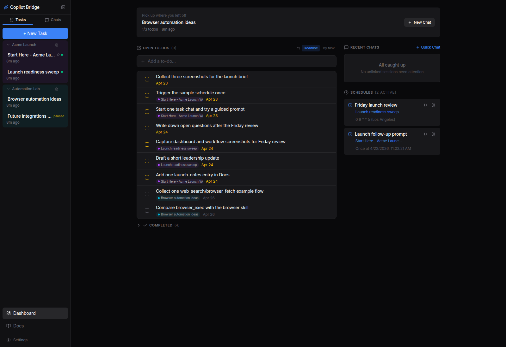
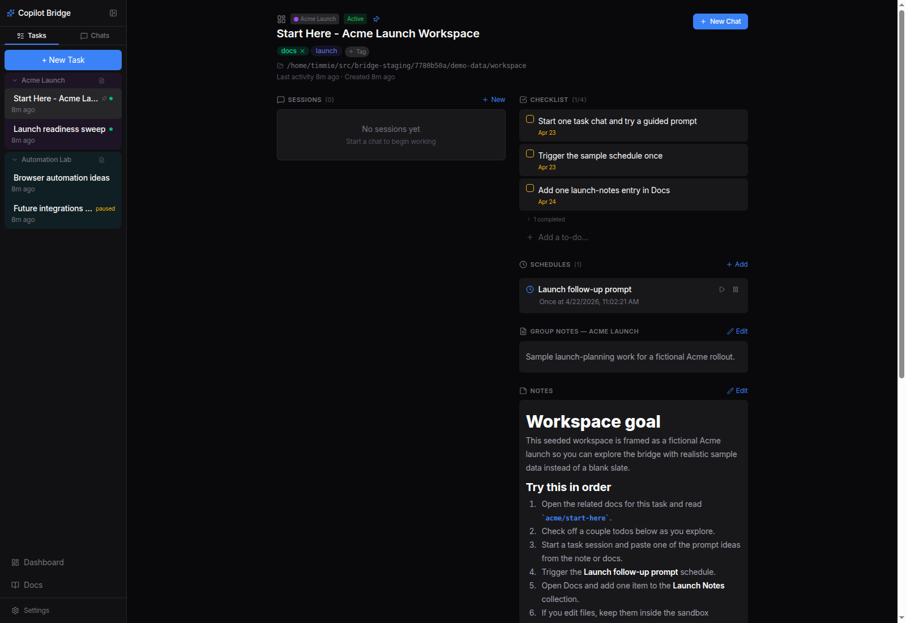
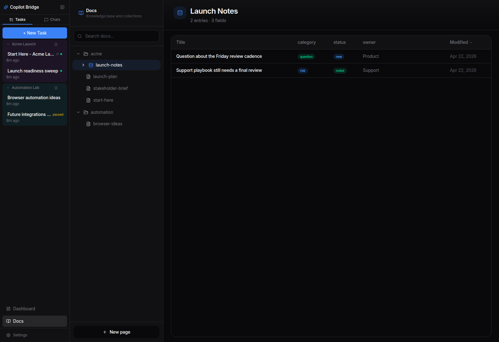

# Copilot Bridge

Copilot Bridge is a local, task-centric AI workspace built on the GitHub Copilot SDK. It combines persistent Copilot sessions, tasks, notes, docs, schedules, linked work, and tool-rich automation in one opinionated app.

This repo is intentionally personal. The goal is not to build a generic SaaS product, but to shape an AI workspace around how one person actually works and then keep iterating on it.

## Screenshots



<table>
  <tr>
    <td width="50%">
      
    </td>
    <td width="50%">
      
    </td>
  </tr>
  <tr>
    <td><strong>Task workspace</strong> — notes, checklist items, schedules, and linked context stay attached to the work.</td>
    <td><strong>Docs collection</strong> — markdown pages and database-style collections live in the same workspace.</td>
  </tr>
</table>

## Why It Is Interesting

- **Task-centric instead of chat-centric** - sessions live next to notes, checklist items, schedules, docs, and linked work.
- **Persistent local workspace** - SQLite-backed app state plus a markdown knowledge base means work survives restarts and browser refreshes.
- **Large tool surface** - the agent can manage tasks, tags, checklist items, docs, schedules, browser sessions, web search, and optional desktop automation from inside the same workspace.
- **Built to improve itself** - launcher-managed restart, update, staging preview, and rollback flows make local self-iteration practical.

## What It Does

- **Task workspace** - tasks, task groups, tags, notes, checklist items, linked sessions, linked work items, linked pull requests, and task dashboards.
- **Persistent Copilot sessions** - quick chats and task-scoped chats with SSE streaming, tool call indicators, unread state, drafts, and archive support.
- **Knowledge base** - markdown pages, wikilinks, preview sheets, and database-style collections for structured notes.
- **Schedules** - cron or one-shot prompts that create fresh task-linked sessions.
- **Provider enrichment** - optional Azure DevOps, GitHub, and Linear integrations for richer work item and pull request cards.
- **Tool-rich automation** - built-in task/doc/schedule tools, web search, browser fetch/exec/session tools, and optional computer-use tools.
- **Workspace customization** - model, reasoning effort, agent identity, custom instructions, theme, favicon, and MCP server registry from the UI.
- **Remote-friendly local deployment** - dev tunnels or your own ingress, optional startup webhooks, and canonical public URL support for previews.

## Architecture

```
┌────────────────────────────────────────────────────┐
│ Launcher (src/launcher.ts)                         │
│ - Starts server + optional tunnel/webhook          │
│ - Handles self_restart / self_update               │
│ - Performs build, health checks, rollback          │
├────────────────────────────────────────────────────┤
│ Express server (src/server/)                       │
│ - REST API + SSE streams                           │
│ - Copilot SDK session manager + custom tools       │
│ - SQLite stores (tasks, schedules, settings, etc.) │
│ - Docs KB, browser tools, staging tools            │
├────────────────────────────────────────────────────┤
│ React client (src/client/)                         │
│ - Dashboard, task rail/panel, chat, docs, settings │
│ - React Query + streaming UI                       │
│ - Mobile-friendly touches like pull-to-refresh     │
└────────────────────────────────────────────────────┘
```

## Getting Started

### Prerequisites

- Node.js 22+ (uses `node:sqlite`)
- [GitHub Copilot CLI](https://github.com/github/copilot-cli) (`npm install -g @github/copilot`)
- [Dev Tunnel CLI](https://aka.ms/devtunnels) (optional, for remote access)
- Optional provider config for Azure DevOps, GitHub, or Linear if you want enriched work items and pull requests
- Optional `COMPUTER_USE=true` if you want desktop automation tools on a trusted local machine

### Install

```bash
git clone https://github.com/timstewartj/copilot-bridge.git
cd copilot-bridge
npm install
cp .env.example .env   # Edit .env with your settings if needed
```

The launcher and direct server entrypoint load `.env` automatically at startup. Existing exported environment variables still win over values from the file.

For Copilot SDK authentication, set `BRIDGE_COPILOT_GITHUB_TOKEN` if you want Bridge to use a dedicated token and skip stored-login/`gh` fallback. Leave it empty to keep the SDK default auth discovery, including GitHub CLI fallback. Bridge uses that same SDK auth to host GitHub MCP `web_search`, so no PAT or separate OAuth app is needed for the built-in web-search path.

### Packaged Release Mode

For teammate installs that should not require git history, build a release bundle:

```powershell
pwsh -NoProfile -File .\scripts\package-release.ps1 -IncludeNodeModules
```

That creates a `release\copilot-bridge-<version>-stable-win-x64.zip` package with root-level `start.ps1`, `stop.ps1`, `update.ps1`, `install-startup-task.ps1`, and `uninstall-startup-task.ps1` scripts plus their shared `release-common.ps1` helper. Release mode starts the compiled launcher from `dist\launcher.js`, skips startup `git pull`, disables git-backed self-update/staging tools, and stores durable state outside the app folder.

Use `-IncludeNodeModules` for teammate installs and update packages. It installs only the packaged server's runtime dependencies into `app\node_modules` instead of copying the full repository dependency tree, omits optional npm packages, and prunes Copilot CLI assets down to the Windows x64 runtime files the Bridge uses. Packages built without `node_modules` are source-light bundles for manual installs only; `update.ps1` rejects them because it cannot safely start and health-check the new app without dependencies.

The packaging script writes a standard `.sha256` sidecar. Use `-Analyze` to generate package size/layout analysis, and `-SmokeTest` to validate the extracted package. When `-SmokeTest` is combined with `-IncludeNodeModules`, it starts the package with isolated temporary state, verifies `/api/health`, and stops it again:

```powershell
pwsh -NoProfile -File .\scripts\package-release.ps1 -IncludeNodeModules -Analyze -SmokeTest
```

For remote updates, `update.ps1 -DownloadUrl` requires an HTTPS URL and a matching `-ExpectedSha256` so the downloaded package is verified before install. Local `-PackagePath` updates can omit the hash, though providing one is still recommended.

GitHub Releases are the canonical release record for tags, release notes, release assets, and signed channel manifests. In-app updates use GitHub Release assets as the default machine-download source and verify a signed manifest before trusting any package URL or SHA. GitHub Actions artifacts are temporary CI outputs only, not the release distribution channel.

The `CI` GitHub Actions workflow validates pull requests and pushes. The `Preview Release` workflow runs automatically on pushes to `master` or `main`, generates a preview version such as `0.1.0-preview.184.1.g09b2447`, builds a runnable `preview` package, uploads workflow artifacts, publishes the package assets to an immutable `preview-<version>` prerelease, writes a signed `preview-win-x64.manifest.json` whose package URL points at that immutable prerelease, and updates the rolling `latest-preview` prerelease with the manifest/signature pointer, a PowerShell bootstrap installer, and a stable `copilot-bridge-preview-win-x64.zip` alias. Preview builds are installable, but they are not stable releases.

For first-time preview installs, use PowerShell:

```powershell
irm https://github.com/TimStewartJ/copilot-bridge/releases/download/latest-preview/install-preview.ps1 | iex
```

The installer requires Node.js 22+ on PATH or `BRIDGE_NODE_PATH`. It downloads the signed preview manifest, verifies the manifest signature, downloads the immutable package listed in that manifest, verifies the package SHA256, installs app files under `%LOCALAPPDATA%\Programs\CopilotBridge`, keeps durable data under `%LOCALAPPDATA%\CopilotBridge`, and starts Bridge. The stable zip alias is for manual download only; the signed manifest remains the trusted update source.

The `Release` GitHub Actions workflow is for official stable builds. It runs on demand, validates the app, calls the packaging script, uploads temporary workflow artifacts for inspection, writes a signed `stable-win-x64.manifest.json`, and can create a draft GitHub Release with the zip, SHA256 sidecar, package analysis, manifest, and detached signature. Use the draft release assets for distribution after reviewing the generated notes and package analysis.

Signed update manifests require an Ed25519 key pair. Generate one with:

```powershell
node .\scripts\generate-update-signing-key.mjs
```

Store the private key in GitHub Secrets as `BRIDGE_UPDATE_MANIFEST_PRIVATE_KEY_PEM`. Store the public key as a GitHub Actions variable or secret named `BRIDGE_UPDATE_MANIFEST_PUBLIC_KEY_PEM`; release packages embed that public key as `app\update-manifest-public-key.pem` so packaged installs can verify future update manifests. The app also supports `BRIDGE_UPDATE_MANIFEST_PUBLIC_KEY_BASE64`, `BRIDGE_UPDATE_MANIFEST_PUBLIC_KEY_PATH`, `BRIDGE_UPDATE_MANIFEST_STABLE_URL`, and `BRIDGE_UPDATE_MANIFEST_PREVIEW_URL` for explicit release config overrides.

Packaged installs expose **Settings > Diagnostics > Updates**. The app checks the stable or preview manifest, verifies its detached signature, and only then enables **Install and restart**. The install endpoint accepts only a channel, never an arbitrary URL from the browser. It re-checks the signed manifest server-side, launches the packaged `update.ps1` in a detached PowerShell process, downloads the verified zip, checks SHA256, stages an inactive release slot, refreshes wrapper scripts with backup/restore protection, queues launcher activation, and writes status to `data\update-status.json`.
Default release state lives under `%LOCALAPPDATA%\CopilotBridge`:

```text
%LOCALAPPDATA%\CopilotBridge\
  data\       # tasks, sessions, docs, settings, schedules
  config\     # release .env
  logs\
  backups\
```

The release boundary is intentional: app files can be replaced during updates, but user data stays in the per-user state folder. Use `BRIDGE_STATE_ROOT` to move that whole state root, or set `BRIDGE_DATA_DIR`, `BRIDGE_DOCS_DIR`, and `COPILOT_HOME` in `%LOCALAPPDATA%\CopilotBridge\config\.env` for finer control. Custom release paths must be absolute.

Changing launcher-owned release settings after the release launcher is already running requires a full `stop.ps1` then `start.ps1`. This includes `BRIDGE_DATA_DIR`, tunnel/webhook settings such as `BRIDGE_ENABLE_TUNNEL`, `BRIDGE_TUNNEL_NAME`, and `BRIDGE_WEBHOOK_URL`, and launcher log paths. Server-child config values can be reloaded with `self_restart`.

When `BRIDGE_TUNNEL_NAME` is not configured, source/dev mode still uses `copilot-bridge`, while release mode derives a stable per-install name such as `copilot-bridge-a1b2c3d4` from the user, machine, and release state path. Set `BRIDGE_TUNNEL_NAME` in the release `.env` if you want a specific tunnel name.

To start the packaged release automatically when you sign in, run this from the extracted release root:

```powershell
.\install-startup-task.ps1
```

That registers a per-user Windows Scheduled Task that runs `start.ps1` at logon. It does not require admin rights for a normal per-user task. If you use a custom `BRIDGE_STATE_ROOT`, set it before installing the task or pass it explicitly:

```powershell
.\install-startup-task.ps1 -StateRoot "D:\BridgeState"
```

When you pass `-StateRoot`, the release root records that state root so `start.ps1` and `update.ps1` use the same durable data location.

If `.bridge-state-root` already exists, `update.ps1` and `install-startup-task.ps1` refuse to switch to a different `BRIDGE_STATE_ROOT` implicitly. Remove or edit `.bridge-state-root` intentionally before changing the active state root.

To remove the startup task later:

```powershell
.\uninstall-startup-task.ps1
```

### Run (Development)

```bash
npm run dev          # Launcher + server + tunnel/webhook support
npm run dev:server   # Server only
npm run dev:client   # Vite dev server with HMR
```

The bridge server listens on port `3333` by default. To use a different local app port, set `BRIDGE_PORT` in your shell or `.env` file before starting the launcher/server:

```bash
BRIDGE_PORT=4444
```

### Fastest Path to Value

If you are opening the bridge for the first time, keep it simple:

1. Run `npm run dev` to start the local workspace.
2. Go to **Settings** and pick your model, reasoning effort, theme, and favicon.
3. Skip Azure DevOps/GitHub/Linear setup for now if you want a clean local workspace.
4. Create a task, add a checklist item and a note, then start a task session.
5. Open **Docs** and create a page or collection entry to exercise the knowledge base.
6. Ask the agent to do something bridge-native, like create a schedule, rename the session, or search the web.

You can get a lot of value on first run without any external work-tracking provider setup: tasks, notes, tags, docs, schedules, and local Copilot sessions all work locally.

### Validate

```bash
npx vitest run <file> # targeted dev test
npm test              # full Vitest regression suite
npm run check:fast    # x-plat audit + client/server type-checking
npm run check:client  # client type-check + client lane
npm run check:server  # server type-check + server/shared lane
npm run check:launcher # server type-check + launcher lane
npm run check:staging # server type-check + staging/integration lane
npm run check:pr      # fast gate + all lanes + full build
npm run check:deploy  # PR gate + preview smoke
npm run test:slow-report # full Vitest pass + top slowest files
```

Use `check:fast` during day-to-day editing, then run the area-specific `check:*` lane that matches the work you touched. Use `check:pr` before asking for review or refreshing a branch, and reserve `check:deploy` for release-quality validation. Coverage is CI-owned: the GitHub Actions CI workflow runs `test:coverage` on PRs, pushes, manual dispatches, and its nightly schedule; local deploy validation still runs the full non-coverage test lanes through `check:pr`. Client type-checking is now explicit and baseline-gated: `npm run typecheck:client` fails only when client diagnostics change from the committed debt baseline, while `npm run typecheck:client:update-baseline` is reserved for intentional debt movement. Vitest forces `NODE_ENV=test` so launcher/staging validations inherited from a production process do not load production-only React test behavior. The legacy `test:preview`, `test:deploy`, and `test:full` aliases remain available and now map onto the clearer validation tiers.

### Cross-Platform Test Rules

- Use the shared helpers in `src/server/__tests__/test-paths.ts` for fake homes, normalized path assertions, and fake executable paths.
- Do not hardcode Unix-only fixtures like `/tmp/...` or `/usr/bin/...` in tests.
- Do not skip Windows with `skipIf(isWindows)` when the behavior can be tested with mocks instead.
- Prefer mocking failure paths over Unix-only filesystem tricks like `chmod`.
- Run `npm run test:preview` before preview/deploy; `staging_preview` also runs it automatically. `preview:smoke` checks the staged preview/backend without re-running validation by default; use `npm run preview:smoke:full` to validate and smoke in one command.

### Build

```bash
npm run build        # Build client + server
npm run build:client # Vite build only
npm run build:server # TypeScript compile only
```

### Public URL Configuration

If you expose the bridge through something other than dev tunnels (for example Cloudflare Tunnel, ngrok, or a reverse proxy), set a canonical public base URL so staging previews can return shareable absolute links:

```bash
BRIDGE_PUBLIC_BASE_URL=https://bridge.example.com
```

If the bridge sits behind a trusted proxy that terminates TLS, also set:

```bash
BRIDGE_TRUST_PROXY=true
```

That allows the server to learn the externally visible origin from incoming requests and use it for staging preview links when no explicit public base URL is configured.

### Auto-Start on Login / Persistent Service (Linux, optional)

You can run the launcher under a user-level `systemd` service:

```ini
# ~/.config/systemd/user/copilot-bridge.service
[Unit]
Description=Copilot Bridge
After=network-online.target
Wants=network-online.target

[Service]
Type=simple
WorkingDirectory=/home/you/src/copilot-bridge
ExecStart=/path/to/node /home/you/src/copilot-bridge/node_modules/tsx/dist/cli.mjs /home/you/src/copilot-bridge/src/launcher.ts
Restart=on-failure
RestartSec=5

[Install]
WantedBy=default.target
```

Replace `/path/to/node` with the output of `which node`. If you installed Node through `nvm`, `fnm`, or `asdf`, using the full path is usually more reliable than relying on the service `PATH`.

Then enable it:

```bash
mkdir -p ~/.config/systemd/user
$EDITOR ~/.config/systemd/user/copilot-bridge.service
systemctl --user daemon-reload
systemctl --user enable --now copilot-bridge
systemctl --user status copilot-bridge
journalctl --user -u copilot-bridge -f
```

Because `WorkingDirectory` points at the repo root, the launcher will still load `.env` automatically. If you want the user service to keep running after logout and start on boot, also run:

```bash
loginctl enable-linger "$USER"
```

### Auto-Start on Login (Windows, optional)

Packaged releases include root-level startup task scripts:

```powershell
.\install-startup-task.ps1
.\uninstall-startup-task.ps1
```

## Project Structure

```
src/
├── launcher.ts                    # Parent process: lifecycle, tunnel, restart/update
├── server/
│   ├── index.ts                   # Express bootstrap
│   ├── api-router.ts              # REST API surface
│   ├── session-manager.ts         # Copilot SDK wrapper + tool registry
│   ├── db.ts                      # SQLite schema/bootstrap
│   ├── task-store.ts              # Tasks, links, ordering
│   ├── checklist-store.ts         # Task/global checklist items
│   ├── schedule-store.ts          # Scheduled sessions
│   ├── docs-store.ts              # Markdown knowledge base
│   ├── settings-store.ts          # App settings + MCP registry
│   ├── staging-tools.ts           # staging_init / preview / deploy
│   └── browser-*.ts               # Browser and web tooling
└── client/
    ├── App.tsx                    # Root app shell + routing
    ├── api.ts                     # Typed client API
    ├── components/
    │   ├── Dashboard.tsx          # Home dashboard
    │   ├── TaskRail.tsx           # Task list and grouping UI
    │   ├── TaskPanel.tsx          # Task details, notes, docs, schedules
    │   ├── ChatView.tsx           # Session history + streaming chat
    │   ├── DocsView.tsx           # Knowledge base UI
    │   └── SettingsView.tsx       # Models, providers, appearance, MCP
    └── hooks/queries/             # React Query data hooks

scripts/
├── start-bridge.ps1               # Start on Windows
├── release-common.ps1             # Shared release wrapper helpers
└── stop-bridge.ps1                # Stop on Windows

data/                              # Runtime data (git-ignored)
├── bridge.db                      # Primary SQLite store
├── docs/                          # Markdown knowledge base
└── ...                            # Logs, metadata, and runtime state
```

## Self-Iteration and Local Deployment

The bridge includes a few different maintenance paths:

1. **`self_restart`** - restart the bridge after local code/config changes, with launcher-managed build and rollback.
2. **`self_update`** - pull the latest repo state, sync dependencies, and restart safely.
3. **`staging_init` -> `staging_preview` -> `staging_deploy`** - make larger changes in an isolated worktree, preview them, then deploy after approval.

The launcher is responsible for checkpointing, building, health checks, and recovering from bad restarts.

## Logs

```bash
tail -n 30 data/bridge.log
tail -n 30 data/bridge-error.log
```

```powershell
Get-Content data\bridge.log -Tail 30
Get-Content data\bridge-error.log -Tail 30
```
