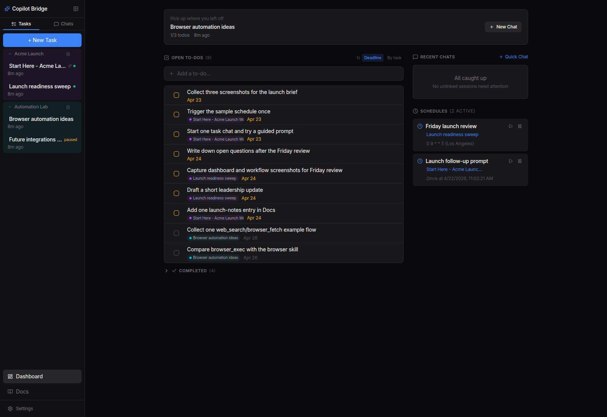
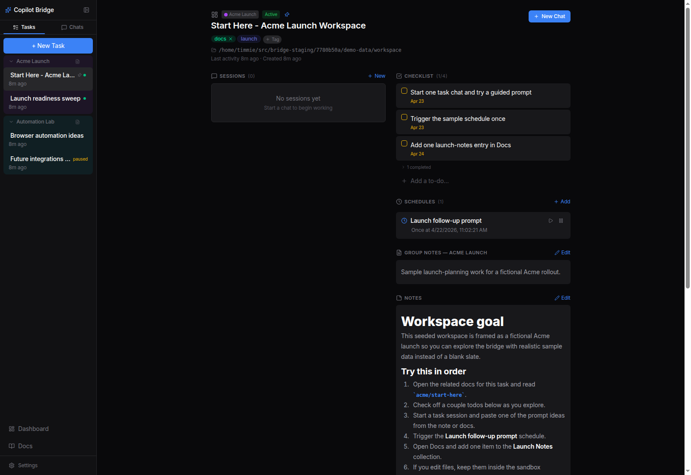
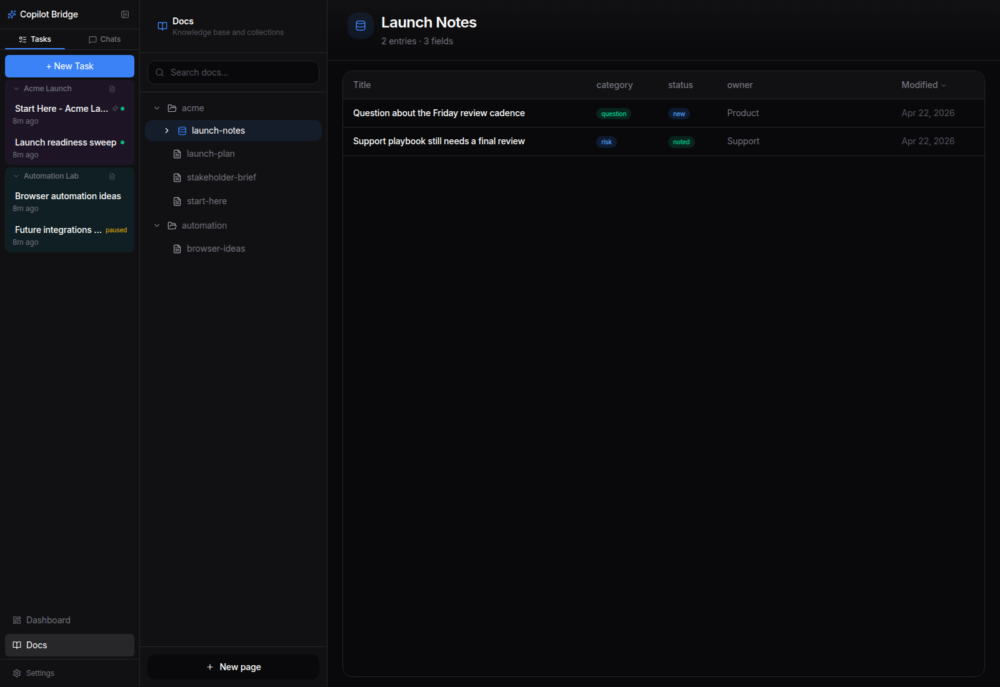

# Copilot Bridge

Copilot Bridge is a local, task-centric AI workspace built on the GitHub Copilot SDK. It combines persistent Copilot sessions, tasks, notes, docs, schedules, linked work, and tool-rich automation in one opinionated app.

This repo is intentionally personal. The goal is not to build a generic SaaS product, but to shape an AI workspace around how one person actually works and then keep iterating on it.

## Screenshots



<table>
  <tr>
    <td width="50%">
      
    </td>
    <td width="50%">
      
    </td>
  </tr>
  <tr>
    <td><strong>Task workspace</strong> — notes, checklist items, schedules, and linked context stay attached to the work.</td>
    <td><strong>Docs collection</strong> — markdown pages and database-style collections live in the same workspace.</td>
  </tr>
</table>

## Why It Is Interesting

- **Task-centric instead of chat-centric** - sessions live next to notes, checklist items, schedules, docs, and linked work.
- **Persistent local workspace** - SQLite-backed app state plus a markdown knowledge base means work survives restarts and browser refreshes.
- **Large tool surface** - the agent can manage tasks, tags, checklist items, docs, schedules, browser sessions, web search, and optional desktop automation from inside the same workspace.
- **Built to improve itself** - launcher-managed restart, update, staging preview, and rollback flows make local self-iteration practical.

## What It Does

- **Task workspace** - tasks, task groups, tags, notes, checklist items, linked sessions, linked work items, linked pull requests, and task dashboards.
- **Persistent Copilot sessions** - quick chats and task-scoped chats with SSE streaming, unread state, drafts, and archive support. The model's thinking streams live and is kept in history: it is read from the `reasoningText` the runtime persists on each assistant message, so it needs no extra model setting and survives reloads. Everything the agent did between two replies (its thinking and its tool calls, in order) folds into one line such as "Worked for 2m 14s · 14 steps" that opens into a timeline; while the run is live that line names the step in flight. Tool calls read as what they did ("Read client/App.tsx", a shell call's own description with its command beside it) and keep the raw tool name, arguments and result one click away.
- **Knowledge base** - markdown pages, wikilinks, preview sheets, and database-style collections for structured notes.
- **Schedules** - cron or one-shot prompts that create fresh task-linked sessions. A run is recorded only after the runtime accepts its prompt. Pre-delivery failures release the scheduled slot for retry instead of consuming it or reporting a successful trigger.
- **Provider enrichment** - optional Azure DevOps, GitHub, and Linear integrations for richer work item and pull request cards.
- **Tool-rich automation** - built-in task/doc/schedule tools, web search, browser fetch/exec/session tools, and optional desktop computer use. Computer use is the Computer Use plugin that ships with the Copilot SDK, loaded per session when Settings > Integrations > Computer use is on. First-prompt tool initialization is shared by runtime handle and must finish before sending. Slow discovery at 30 seconds reports progress, not failure; the hard readiness budget covers both bounded backend RPCs. Failed initialization never counts as ready. Timing and outcome are recorded as `session.tools.initialization` telemetry spans.
- **Workspace customization** - model, reasoning effort, agent identity, custom instructions, theme, favicon, and MCP server registry from the UI.
- **Session details** - a compact chat bar shows MCP connections, context usage, and session cost. Expand it for a width-bounded details panel with context headroom and a selectable line history (last 30 turns or all loaded turns). The graph's accessible data table stays visually hidden, including its caption. Token breakdowns and provider capabilities stay under Usage details; MCP failures and sign-in actions open automatically. MCP connection status is separate from tool execution authorization, input validation, and query/server errors. Expanded session details show recent failed-tool categories and guidance without treating permission or query failures as connection outages. Resource-denied/403 failures are classified as permission failures, separately from missing/expired authentication; neither triggers automatic retry or reauthentication. Explicit Kusto semantic/assert failures remain query/server failures even when wrapped in a generic 400 Bad Request. Stale MCP runtime-session recovery is limited to transport failures, not permission, authentication, or query failures. Status observations carry timestamps, session provenance, and live-event/replay-event/probe origin; settings use the newest observation rather than cache insertion order. Complete session observations are re-probed after 30 seconds when a runtime session is available, while replayed observations are never treated as fresh. Transient discovery errors are cleared when a subsequent status reports connected. Session status responses expose tool initialization readiness separately (`toolReadiness`: initializing, ready, failed, or null when unknown). Initializing/failed readiness returns cached connection observations without waiting for or re-running discovery; session details poll initializing readiness and display its timestamps and failure cause. Initialization completion and an empty MCP list are not conclusive proof of tool capabilities or resource permissions. The graph uses the latest measured context snapshot per turn, ignoring usage-only snapshots. Measurements are fetched for each loaded turn independently of the recent-event cap. History is retained in SQLite across restarts until session deletion; the UI loads the latest 200 turns and labels partial coverage explicitly. Gaps mean usage was not reported, not zero usage.
- **Remote-friendly local deployment** - dev tunnels or your own ingress, optional startup webhooks, and canonical public URL support for previews.
- **Helm** - Bridge's orchestration manager (`/helm`), inside the normal layout next to your tasks and chats. Ask what needs you, hear what finished, read replies, answer a session's question, hand work to sessions on stronger models, and keep tasks, schedules, Focus items and docs tidy. Helm only coordinates: it has Bridge's management tools and nothing that edits code, browses or deploys, and it runs on a cheap, fast model by default (choose another in its settings).
  - **Chat or hands-free, one conversation** - Helm uses the same chat view as every session (streaming, drafts, chat mic, model switcher). **Hands-free** is a mode of that conversation, not a separate assistant: voice turns run through the same session, so you can switch in and out mid-thought without losing context, and everything said out loud is in the transcript. While hands-free is on, typed messages are answered out loud too, details that are awkward to hear are shown in chat instead of spoken, and a small pill keeps it running while you open the session or task Helm pointed you to.
  - **Long speech stays complete** - recordings and long hands-free turns use recognition chunks capped at 20 seconds, including padding, even when steady noise hides pauses. This prevents the recognizer dropping whole sentences from oversized input.
  - **Each mode thinks at its own effort** - typed turns use `max` reasoning effort and spoken turns `xhigh` by default (Helm settings → Thinking effort), because a reply you read can take a few more seconds than one you wait for in silence. Helm switches the session's effort at the start of each turn, only when the mode changed, so both modes still share one conversation. Anything answered out loud counts as spoken, including a message typed while hands-free is on; a level the model lacks falls back to the nearest one below it.
  - **Native Bridge references** - agents link Bridge's own things as `bridge://session/<id>`, `bridge://task/<id>` and `bridge://doc/<path>` (plain app routes work too). Any chat renders them as chips with live status (waiting on you, running, unread) that navigate in-app; a link alone on its line becomes a card.
  - **Easy to reset, still resumable, never eternal** - **New** starts a clean conversation and keeps the old one in history. Helm opens fresh after 6 idle hours with a one-click way back to where you left off. Conversations stay resumable for 14 days (at most 25), then expire unless you keep them. They live in Helm's own history rather than the chat lists.
  - **Voice pipeline** - speech detection, Smart Turn end-of-turn detection, Parakeet speech recognition, and Kokoro voices run locally in an isolated engine process; only text reaches your Copilot model. Barge-in, sleep and the "Hey Bridge" wake phrase, spoken lead-ins while tools run, and announcements when sessions Helm dispatched finish. Audio streams over WebSocket, falling back to HTTP POST + SSE for tunnels and proxies that block upgrades. Per-conversation JSONL logs live in `data/voice/logs`. `/voice` redirects to Helm.
- **Local speech engine** - one on-demand install (~920 MB of pinned, digest-verified packages and models in `data/voice`, override with `BRIDGE_VOICE_DIR`) from **Settings → Voice** or the first time you go hands-free in Helm. It powers both Helm's hands-free mode and the chat mic: where WebCodecs Opus is available (Chrome, Edge, desktop Firefox, Safari 26+), the browser encodes mono capture at 32 kbit/s as Ogg Opus while retaining a 16 kHz WAV fallback: about an eighth of the upload. Opus is lossy, so transcripts can differ slightly from WAV. Unsupported or failed encodings use WAV, and `BRIDGE_TRANSCRIPTION_OPUS_UPLOADS=false` disables compression for new recordings. Encoding uses a 48 kHz capture clock to preserve codec delay and exact recording length; then the engine transcribes recordings on the CPU with Parakeet v3 (25 European languages, automatic punctuation), split at pauses so long clips never hold up a live conversation. A recording can run for 5 minutes (`BRIDGE_TRANSCRIPTION_MAX_DURATION_SECONDS`): the composer shows the clock against that limit and, on reaching it, stops and submits what it has. The engine process starts on first use, loads only the models a feature needs, and exits after 10 idle minutes.
- **Speech engine setup on locked-down hosts** - the npm packages are fetched with the machine's own npm client (`npm pack`), so a private registry and its credentials, proxy and CA settings apply exactly as they did when Bridge itself was installed; the models come over HTTPS from GitHub Releases and Hugging Face. Everything is checked against a pinned digest whichever way it arrives. A host that can reach neither source can still be set up: copy the archives into `data/voice/downloads` (`npm pack <name>@<version>` produces the package files) and run setup again, which uses them without touching npm or the network. A failed setup names the file, the real reason (npm's error code or the connection error behind "fetch failed"), and those by-hand steps. If Node itself cannot connect because of a required proxy or TLS inspection, start Bridge with Node's own switches for that: `NODE_OPTIONS=--use-env-proxy` or `--use-system-ca` (Node 22.21+), or `NODE_EXTRA_CA_CERTS`.

## Architecture

```
┌────────────────────────────────────────────────────┐
│ Launcher (src/launcher.ts)                         │
│ - Supervises server + optional dev tunnel          │
│ - Handles self_restart / self_update               │
│ - Performs build, health checks, rollback          │
├────────────────────────────────────────────────────┤
│ Express server (src/server/)                       │
│ - REST API + SSE streams                           │
│ - Copilot SDK session manager + custom tools       │
│ - SQLite stores (tasks, schedules, settings, etc.) │
│ - Docs KB, browser tools, staging tools            │
├────────────────────────────────────────────────────┤
│ React client (src/client/)                         │
│ - Dashboard, task rail/panel, chat, docs, settings │
│ - React Query + streaming UI                       │
│ - Mobile-friendly touches like pull-to-refresh     │
└────────────────────────────────────────────────────┘
```

## Getting Started

### Prerequisites

- Node.js 22+ (uses `node:sqlite`)
- GitHub Copilot access, authenticated through `BRIDGE_COPILOT_GITHUB_TOKEN`, GitHub CLI, or a [Copilot CLI](https://github.com/github/copilot-cli) login
- [Dev Tunnel CLI](https://aka.ms/devtunnels) (optional, for remote access)
- Optional provider config for Azure DevOps, GitHub, or Linear if you want enriched work items and pull requests
- Optional desktop computer use, turned on from Settings > Integrations on a trusted local machine

### Install

```bash
git clone https://github.com/timstewartj/copilot-bridge.git
cd copilot-bridge
npm install
cp .env.example .env   # Edit .env with your settings if needed
```

The launcher and direct server entrypoint load `.env` automatically at startup. Existing exported environment variables still win over values from the file.

For Copilot SDK authentication, set `BRIDGE_COPILOT_GITHUB_TOKEN` if you want Bridge to use a dedicated token and skip stored-login/`gh` fallback. Leave it empty to keep the SDK default auth discovery, including GitHub CLI fallback. Bridge uses that same SDK auth to host GitHub MCP `web_search`, so no PAT or separate OAuth app is needed for the built-in web-search path.

GitHub work item and pull request enrichment reuses the same ambient auth: `BRIDGE_COPILOT_GITHUB_TOKEN`, then `GH_TOKEN`, then `GITHUB_TOKEN`, then `gh auth token`. With no token available it still enriches public repositories anonymously. Fully qualified references (`owner/repo#123`, an issue/PR URL, or an `owner/repo` PR repository) work without any GitHub provider settings; the optional owner/default-repo settings only resolve short references like `123` or `repo#123`.

### Copilot Runtime

Bridge uses `@github/copilot-sdk` 1.0.14 and launches the pinned `@github/copilot` CLI (1.0.87-0 prerelease) through its npm
loader, so a CLI release can be validated independently of the SDK's bundled runtime. Install optional dependencies
(the npm default) so the platform-specific CLI and SDK packages are present; no separate CLI runtime override or
wrapper is needed. The SDK natively forwards GitHub MCP configuration, structured `ask_user` elicitation, and Bridge
tool-loading metadata.

Automatic tool approvals are configured once per runtime handle using the CLI's native permission
mode, before tool initialization or prompt delivery. Bridge no longer answers each approval through
an SDK callback. Native policy refusal or initialization failure stops delivery explicitly; managed
restrictions and content exclusions remain runtime-enforced. Agent questions and Computer Use
confirmations keep their existing flows, and cloud-backed agentic memory stays disabled.

HydraFusion uses the runtime's native orchestration, with its startup feature flags enabled and experimental
mode supplied on session creation and resume. Sessions select `hydrafusion` directly, without first creating
a different model's session. Reasoning effort and context tier are chosen by HydraFusion rather than fixed
in Bridge. This is a research preview; its native feature flags are tied to the pinned CLI version.

### Packaged Release Mode

For teammate installs that should not require git history, build a release bundle:

```powershell
pwsh -NoProfile -File .\scripts\package-release.ps1 -IncludeNodeModules
```

That creates a `release\copilot-bridge-<version>-stable-win-x64.zip` package with root-level `start.ps1`, `stop.ps1`, `update.ps1`, `install-startup-task.ps1`, and `uninstall-startup-task.ps1` scripts plus their shared `release-common.ps1` helper. Release mode starts the compiled launcher from `dist\launcher.js`, skips startup `git pull`, disables git-backed self-update/staging tools, and stores durable state outside the app folder.

Use `-IncludeNodeModules` for teammate installs and update packages. It installs only the packaged server's runtime dependencies into `app\node_modules` instead of copying the full repository dependency tree, including the SDK's optional platform-native runtime package. Packages built without `node_modules` are source-light bundles for manual installs only; `update.ps1` rejects them because it cannot safely start and health-check the new app without dependencies.

The packaging script writes a standard `.sha256` sidecar. Use `-Analyze` to generate package size/layout analysis, and `-SmokeTest` to validate the extracted package. When `-SmokeTest` is combined with `-IncludeNodeModules`, it starts the package with isolated temporary state, verifies `/api/health`, and stops it again:

```powershell
pwsh -NoProfile -File .\scripts\package-release.ps1 -IncludeNodeModules -Analyze -SmokeTest
```

For remote updates, `update.ps1 -DownloadUrl` requires an HTTPS URL and a matching `-ExpectedSha256` so the downloaded package is verified before install. Local `-PackagePath` updates can omit the hash, though providing one is still recommended.

GitHub Releases are the canonical release record for tags, release notes, release assets, and signed channel manifests. In-app updates use GitHub Release assets as the default machine-download source and verify a signed manifest before trusting any package URL or SHA. GitHub Actions artifacts are temporary CI outputs only, not the release distribution channel.

The `CI` GitHub Actions workflow validates pull requests and pushes. The `Preview Release` workflow runs automatically on pushes to `master` or `main`, generates a preview version such as `0.1.0-preview.184.1.g09b2447`, builds a runnable `preview` package, uploads workflow artifacts, publishes the package assets to an immutable `preview-<version>` prerelease, writes a signed `preview-win-x64.manifest.json` whose package URL points at that immutable prerelease, and updates the rolling `latest-preview` prerelease with the manifest/signature pointer, a PowerShell bootstrap installer, and a stable `copilot-bridge-preview-win-x64.zip` alias. Preview builds are installable, but they are not stable releases.

For first-time preview installs, use PowerShell:

```powershell
irm https://github.com/TimStewartJ/copilot-bridge/releases/download/latest-preview/install-preview.ps1 | iex
```

The installer requires Node.js 22+ on PATH or `BRIDGE_NODE_PATH`. It downloads the signed preview manifest, verifies the manifest signature, downloads the immutable package listed in that manifest, verifies the package SHA256, installs app files under `%LOCALAPPDATA%\Programs\CopilotBridge`, keeps durable data under `%LOCALAPPDATA%\CopilotBridge`, and starts Bridge. The stable zip alias is for manual download only; the signed manifest remains the trusted update source.

The `Release` GitHub Actions workflow is for official stable builds. It runs on demand, validates the app, calls the packaging script, uploads temporary workflow artifacts for inspection, writes a signed `stable-win-x64.manifest.json`, and can create a draft GitHub Release with the zip, SHA256 sidecar, package analysis, manifest, and detached signature. Use the draft release assets for distribution after reviewing the generated notes and package analysis.

Signed update manifests require an Ed25519 key pair. Generate one with:

```powershell
node .\scripts\generate-update-signing-key.mjs
```

Store the private key in GitHub Secrets as `BRIDGE_UPDATE_MANIFEST_PRIVATE_KEY_PEM`. Store the public key as a GitHub Actions variable or secret named `BRIDGE_UPDATE_MANIFEST_PUBLIC_KEY_PEM`; release packages embed that public key as `app\update-manifest-public-key.pem` so packaged installs can verify future update manifests. The app also supports `BRIDGE_UPDATE_MANIFEST_PUBLIC_KEY_BASE64`, `BRIDGE_UPDATE_MANIFEST_PUBLIC_KEY_PATH`, `BRIDGE_UPDATE_MANIFEST_STABLE_URL`, and `BRIDGE_UPDATE_MANIFEST_PREVIEW_URL` for explicit release config overrides.

Packaged installs expose **Settings > Diagnostics > Updates**. The app checks the stable or preview manifest, verifies its detached signature, and only then enables **Install and restart**. The install endpoint accepts only a channel, never an arbitrary URL from the browser. It re-checks the signed manifest server-side, launches the packaged `update.ps1` in a detached PowerShell process, downloads the verified zip, checks SHA256, stages an inactive release slot, refreshes wrapper scripts with backup/restore protection, queues launcher activation, and writes status to `data\update-status.json`.
Default release state lives under `%LOCALAPPDATA%\CopilotBridge`:

```text
%LOCALAPPDATA%\CopilotBridge\
  data\       # tasks, sessions, docs, settings, schedules
  config\     # release .env
  logs\
  backups\
```

The release boundary is intentional: app files can be replaced during updates, but user data stays in the per-user state folder. Use `BRIDGE_STATE_ROOT` to move that whole state root, or set `BRIDGE_DATA_DIR`, `BRIDGE_DOCS_DIR`, and `COPILOT_HOME` in `%LOCALAPPDATA%\CopilotBridge\config\.env` for finer control. Custom release paths must be absolute.

Changing launcher-owned release settings after the release launcher is already running requires a full `stop.ps1` then `start.ps1`. This includes `BRIDGE_DATA_DIR`, tunnel/webhook settings such as `BRIDGE_ENABLE_TUNNEL`, `BRIDGE_TUNNEL_NAME`, and `BRIDGE_WEBHOOK_URL`, and launcher log paths. Server-child config values can be reloaded with `self_restart`.

The launcher owns one persistent dev tunnel named `copilot-bridge` by default. It keeps that tunnel running across server restarts, publishes its URL for staging links, and restarts it with bounded backoff after process or public-health failures. Set `BRIDGE_TUNNEL_NAME` for a different persistent tunnel, or `BRIDGE_ENABLE_TUNNEL=false` when using your own ingress. Access-controlled tunnels (for example after `devtunnel access reset <tunnel>` to require sign-in) are supported: the public health probe treats the relay's sign-in redirect as "reachable" rather than as an outage, so the tunnel is not recycled for being private.

To start the packaged release automatically when you sign in, run this from the extracted release root:

```powershell
.\install-startup-task.ps1
```

That registers a per-user Windows Scheduled Task that runs `start.ps1` at logon. It does not require admin rights for a normal per-user task. If you use a custom `BRIDGE_STATE_ROOT`, set it before installing the task or pass it explicitly:

```powershell
.\install-startup-task.ps1 -StateRoot "D:\BridgeState"
```

When you pass `-StateRoot`, the release root records that state root so `start.ps1` and `update.ps1` use the same durable data location.

If `.bridge-state-root` already exists, `update.ps1` and `install-startup-task.ps1` refuse to switch to a different `BRIDGE_STATE_ROOT` implicitly. Remove or edit `.bridge-state-root` intentionally before changing the active state root.

To remove the startup task later:

```powershell
.\uninstall-startup-task.ps1
```

### Run (Development)

```bash
npm run dev          # Launcher + server + tunnel/webhook support
npm run dev:server   # Server only
npm run dev:client   # Vite dev server with HMR
```

On Windows, `.\scripts\start-bridge.ps1` launches the durable outer supervisor
in the background; `-Wait` keeps the caller attached for Scheduled Task setups.
`.\scripts\stop-bridge.ps1`
writes an intentional-stop sentinel before terminating this checkout's process
tree, so the supervisor will not relaunch it. It stops the tree's roots before
their descendants, so nothing respawns mid-stop, and verifies process identities
against one process snapshot per pass. A normal
`.\scripts\start-bridge.ps1` explicitly clears that sentinel; to resume in
supervised mode, use `.\scripts\start-bridge.ps1 -Wait -ClearIntentionalStop`.

The bridge server listens on port `3333` by default. To use a different local app port, set `BRIDGE_PORT` in your shell or `.env` file before starting the launcher/server:

```bash
BRIDGE_PORT=4444
```

### Fastest Path to Value

If you are opening the bridge for the first time, keep it simple:

1. Run `npm run dev` to start the local workspace.
2. Go to **Settings** and pick your model, reasoning effort, theme, and favicon.
3. Skip Azure DevOps/GitHub/Linear setup for now if you want a clean local workspace.
4. Create a task, add a checklist item and a note, then start a task session.
5. Open **Docs** and create a page or collection entry to exercise the knowledge base.
6. Ask the agent to do something bridge-native, like create a schedule, rename the session, or search the web.

You can get a lot of value on first run without any external work-tracking provider setup: tasks, notes, tags, docs, schedules, and local Copilot sessions all work locally.

### Response Style and Prompt Settings

**Settings > General > System Prompt** separates identity, response style, and additional custom instructions. Response Style starts with **Natural and direct** guidance and **Adaptive** detail. Choose **Concise** or **Detailed** as a default, edit the guidance (up to 4,000 characters), or use **Reset to default**. Blank guidance uses the default. Edits and resets remain in the draft until **Save**.

Each new conversational session and fresh resume receives one stable `<response_style>` block and a separate, always-included `<response_quality>` block. Explicit requests for tone, detail, or output format override style defaults. Quality guidance covers supported claims, material uncertainty, independent judgment, and accurate reporting of research, changes, and tests; it is not disabled by style settings. Specialized machine-output workers keep their own prompts. Saving does not interrupt active or cached sessions; a cached chat picks up changes when its runtime handle is freshly resumed.

The unmodified `<anti_slop_response_quality>` block previously added to Custom Instructions is normalized into the new defaults without duplicating it in the prompt. Saving settings persists the migrated fields. Other custom instructions and explicitly configured response styles are preserved. Edited or incomplete legacy blocks remain untouched and show a review notice in settings.

The settings API accepts `responseStyle: { detail: "adaptive" | "concise" | "detailed", guidance: string }`. Omitted fields within a supplied object use their defaults; `{}` resets the style. Unsupported keys, invalid types or detail values, and guidance longer than 4,000 characters after trimming are rejected without changing settings.

### Validate

```bash
npx vitest run <file> # targeted dev test
npm test              # full Vitest regression suite
npm run check:fast    # x-plat audit + design audit + client/server type-checking
npm run check:client  # design audit + client type-check + client lane
npm run check:server  # server type-check + server/shared lane
npm run check:integration # type-check + API, workflow, persistence/lifecycle, and native process tests
npm run check:launcher # server type-check + launcher lane
npm run check:staging # server type-check + staging tooling lane + native process tests
npm run check:native  # server type-check + native process tests only
npm run check:pr      # fast gate + all lanes + full build
npm run check:deploy  # PR gate + preview smoke
npm run test:slow-report # full Vitest pass + top slowest files
```

Use `check:fast` during day-to-day editing, then run the area-specific `check:*` lane that matches the work you touched. Use `check:pr` before asking for review or refreshing a branch, and reserve `check:deploy` for release-quality validation. Coverage is CI-owned: the GitHub Actions CI workflow runs `test:coverage` on PRs, pushes, manual dispatches, and its nightly schedule; local deploy validation still runs the full non-coverage test lanes through `check:pr`. Client type-checking (`npm run typecheck:client`) is a plain `tsc --noEmit` over `tsconfig.client.json` and must stay at zero diagnostics. Vitest forces `NODE_ENV=test` so launcher/staging validations inherited from a production process do not load production-only React test behavior.

### Pagination query parameters

The GET endpoints `/api/schedules/:id/sessions`, `/api/docs/search`, and
`/api/docs/db/*folder` validate `limit` as a positive integer and `offset` as a
non-negative integer. Negative, fractional, non-numeric, and unsafe integer values
return HTTP 400 with an `{ "error": "..." }` body; `limit=0` is invalid, while
`offset=0` is valid. Omitted parameters retain these defaults:

| Endpoint | Default limit | Maximum limit | Default offset |
| --- | --- | --- | --- |
| Schedule sessions | 20 | 100 | 0 |
| Docs search | 50 | 200 | 0 |
| Docs database entries | 10000 | 10000 | 0 |

Valid limits above the endpoint maximum are clamped. Offsets accept integers up
to `Number.MAX_SAFE_INTEGER`.

### Context and prompt-cache diagnostics

Resumes still pending at 30 seconds emit `session.resume.diagnostic` spans with
attempt/session identity, purpose, backend generation/PID, elapsed time and
connection state. One 5-second ping observes responsiveness without triggering
recovery. The unchanged 60-second timeout and eventual backend result are recorded;
`wrapperEnded` distinguishes settlement after Bridge stopped waiting (including
fencing). Fast resumes emit nothing; payloads and raw errors are excluded.
Ping success does not prove resume progress, nor timeout a deadlock. These
diagnostics cannot identify the native lock owner or guarantee a root cause.

`BRIDGE_SUPPRESS_PASSIVE_RESUME_EVENTS=true` enables a temporary workaround for
Copilot's native resume/MCP callback deadlock. It suppresses `session.resume` only
when the chat navigation warmup endpoint reconnects an idle session. Warming and
cache reuse still run; the next send uses that handle without a second resume.
The skipped event is a lifecycle/settings snapshot, not conversation history:
native resume-related side effects and metrics are omitted for that attachment.
Fork warmups, cold sends, reloads, model switches, and interrupted-run recovery
remain unchanged. This is containment, not a correction to the native locks.
The switch defaults to false; invalid values warn and leave it disabled. It is
read from the manager's runtime environment at startup. Set false/unset and
restart the server to restore normal events on subsequent warmups. Successful
`session.warm.coldResume`/`session.warm` spans include `source` and
`resumeEventSuppressed` so the selected path can be verified without payloads.

Copilot `assistant.usage` and shutdown metrics count cache reads/writes within
input tokens and reasoning within output tokens. Context occupancy uses explicit
context counts, not those per-call or cumulative usage totals. Other normalized
usage shapes retain their existing additive contract.

`session.prompt.applied` compares only accepted SDK-handle configurations, including
the latest retained applied span after restart. Warm handle reuse emits no new
applied span. Telemetry pruning removes that historical baseline; malformed or
unreadable history is marked in `previousRead`. Applied and cache-break spans carry
a process startup marker. Cache-break reasons remain hashed with category `unknown`
because the installed runtime exposes open strings, not verified reason constants.
Changed cache-field names remain counts only. Event/agent IDs are bounded, model
and agent names are hashed, and request snapshots are never recorded. API/provider
call IDs are available on usage events, not cache-break events.

### Cross-Platform Test Rules

- Use the shared helpers in `src/server/__tests__/test-paths.ts` for fake homes, normalized path assertions, and fake executable paths.
- Do not hardcode Unix-only fixtures like `/tmp/...` or `/usr/bin/...` in tests.
- Do not skip Windows with `skipIf(isWindows)` when the behavior can be tested with mocks instead.
- Prefer mocking failure paths over Unix-only filesystem tricks like `chmod`.
- Name a test `*.native.test.ts` when it drives real OS process trees (PowerShell/CIM snapshots, `taskkill`, staged backend children, the Copilot CLI). Only the `native` project runs those; on Windows it runs one file at a time after the parallel projects finish.
- Wait for a completion signal (a returned promise, a settle hook, or a lifecycle callback) instead of polling for background work. When polling is unavoidable, `vi.waitFor` has a shared 20s hang-guard budget; do not tighten it for real I/O.
- Tests never see the live Bridge runtime environment: the shared Vitest config strips inherited `BRIDGE_*`, `COPILOT_*`, and GitHub token variables, so stub what a test needs with `vi.stubEnv()` or `withTestEnv()`.
- Self-update validates in a Git-free release-slot copy. Source-management tests must model checkout metadata explicitly: use `withTestSourceCheckout()` from `test-paths.ts` in a file-local `node:fs` mock. It supplies only this source tree's `.git` marker and delegates other paths; do not restore inherited runtime settings or assume host Git metadata exists.
- Run `npm run check:pr` before preview/deploy; `staging_preview` also runs validation automatically. `preview:smoke` checks the staged preview/backend without re-running validation by default; use `npm run preview:smoke:full` to validate and smoke in one command.

### Design System

Every client screen is built from `src/client/design/`: `tokens.ts` holds the class recipes, `primitives.tsx` the components, and its `README.md` the rules (content is the only full-contrast text; group with space, hairlines and rails instead of boxes; one line that opens for more; colour only for state; accent is never a fill; one primary action per screen).

- `npm run test:design-audit` runs in `check:fast`, `check:client` and `check:pr`. It fails on the retired patterns in any client file that is not listed in `src/client/design/audit-pending.ts`.
- That list names the screens written before the system existed. It only shrinks: never add a file to it, and remove a file once it is migrated (the audit fails until you do).
- `npx tsx src/client/design/audit.ts --explain <file>` lists what a file still breaks.

### Build

```bash
npm run build        # Build client + server
npm run build:client # Vite build only
npm run build:server # TypeScript compile only
```

### Runtime session retirement

Each evicted handle has one retirement episode, identified by a lease and backend
generation. Bridge calls the adapter's required, single-flight `release()`; the
runtime owns task teardown. Retirement does not enumerate/cancel/remove tasks or
delete transcripts. Live task monitoring, user cancellation, and active-parent
capacity reaping remain separate.

Release waits for already-running raw task operations, not their timeout wrappers.
After five seconds without confirmed release, the handle is quarantined. New work
is held; existing runs get the remainder of a fixed 60-second retirement budget.
Late release can clear quarantine before recycling, but timeout never clears ownership.

At the deadline, `cleanup-stalled` uses the same replacement mechanism as transport
recovery and model refresh: retain owner, confirm its `fence()`, discard old handles
and reservations, then own/start the replacement. Recovery retries fencing that could
not observe or finish in time (a timed-out snapshot or observation, an exhausted
deadline, unknown survivor status, or a taskkill that ran out of time) with backoff for
up to five minutes. Processes a failed attempt may already have signalled stay
unverified: the next attempt re-checks them with one process-table read and terminates
any that are still alive before it acknowledges, because a killed parent orphans its
surviving children. Unknown ownership, unverifiable identities, and processes that
outlive their kill block recovery immediately. Failed candidate startup followed by
confirmed candidate fencing permits at most two more start attempts. A blocked recovery
publishes `agentBackend.recoveryBlockedAt`; the launcher force-restarts a server that
has reported it for 60 seconds, at most three times per hour, and only reports (log
plus optional webhook) when that budget is spent or automatic recovery is suppressed.
Shutdown can always reach the current owner.
Accepted interactive work uses the existing continuation/cooldown policy; quiet
defer turns are not automatically continued. Expiring a resume barrier also requires
fenced recovery rather than admitting another handle.

**Contract limit:** release acknowledges SDK handle ownership, not zero remaining OS
processes. Pinned SDK 1.0.13 / CLI 1.0.84-3 Linux experiments found attached children
draining for about five seconds after release, even with the former reaper or an
additional native close call. Do not infer process exit from an empty task list,
successful resume, or healthy ping.

Runtime fencing uses one absolute deadline shared by SessionManager and the backend.
The default 111-second aggregate budget is derived from two 48-second process-tree
termination phases (two 20-second CIM snapshots, a 5-second taskkill, and 3 seconds of
spawn overhead) plus bounded startup (10 seconds) and SDK child-exit confirmation
(5 seconds). Concurrent callers join the in-flight attempt without resetting its
deadline, and it is not reset per PID. Only a retryable failure lets a later recovery
attempt start a fresh one, and a fenced backend never starts again. A shutdown caller
can supply its shorter remaining deadline without extending the server's 13-second
shutdown budget. Each native subtree is terminated and identity-verified before the
loader; captured descendants covered by that verification are not scanned again.
Retained orphans still require their own verified cleanup. Survivor checks batch all
remaining identities into one process-table read per check. Missing creation markers
or unreadable verification remain unknown, never proof of exit or PID replacement.

Release/quarantine spans carry lease, generation, timing and outcome; backend recovery
spans record replacement reasons and failures. `backend.fence` records the ownership
acknowledgement, and `backend.fence.phase` records startup, snapshot, termination,
verification, survivor, and child-exit timings and errors. No failed retirement
episode is retried. A timed-out RPC triggers a liveness probe, and the runtime is
declared lost only after three consecutive ping timeouts while its transport still
looks alive (immediately when the process exits, the pipe closes, or a ping fails for
another reason). That indicates unresponsiveness, not proof that the runtime process
crashed or its transport physically closed.

### Public URL Configuration

If you expose the bridge through something other than dev tunnels (for example Cloudflare Tunnel, ngrok, or a reverse proxy), set a canonical public base URL so staging previews can return shareable absolute links:

```bash
BRIDGE_PUBLIC_BASE_URL=https://bridge.example.com
```

If the bridge sits behind a trusted proxy that terminates TLS, also set:

```bash
BRIDGE_TRUST_PROXY=true
```

That allows the server to learn the externally visible origin from incoming requests and use it for staging preview links when no explicit public base URL is configured.

### Auto-Start on Login / Persistent Service (Linux, optional)

You can run the launcher under a user-level `systemd` service:

```ini
# ~/.config/systemd/user/copilot-bridge.service
[Unit]
Description=Copilot Bridge
After=network-online.target
Wants=network-online.target

[Service]
Type=simple
WorkingDirectory=/home/you/src/copilot-bridge
ExecStart=/path/to/node /home/you/src/copilot-bridge/node_modules/tsx/dist/cli.mjs /home/you/src/copilot-bridge/src/launcher.ts
Restart=on-failure
RestartPreventExitStatus=64 70
RestartSec=5

[Install]
WantedBy=default.target
```

Replace `/path/to/node` with the output of `which node`. If you installed Node through `nvm`, `fnm`, or `asdf`, using the full path is usually more reliable than relying on the service `PATH`.

Then enable it:

```bash
mkdir -p ~/.config/systemd/user
$EDITOR ~/.config/systemd/user/copilot-bridge.service
systemctl --user daemon-reload
systemctl --user enable --now copilot-bridge
systemctl --user status copilot-bridge
journalctl --user -u copilot-bridge -f
```

Because `WorkingDirectory` points at the repo root, the launcher will still load `.env` automatically. If you want the user service to keep running after logout and start on boot, also run:

```bash
loginctl enable-linger "$USER"
```

### Auto-Start on Login (Windows, optional)

Packaged releases include root-level startup task scripts:

```powershell
.\install-startup-task.ps1
.\uninstall-startup-task.ps1
```

## Project Structure

```
src/
├── launcher.ts                    # Parent process: server and restart/update lifecycle
├── launcher-tunnel-supervisor.ts  # Managed dev tunnel lifecycle
├── server/
│   ├── index.ts                   # Express bootstrap
│   ├── api-router.ts              # REST API surface
│   ├── session-manager.ts         # Copilot SDK wrapper + tool registry
│   ├── db.ts                      # SQLite schema/bootstrap
│   ├── task-store.ts              # Tasks, links, ordering
│   ├── checklist-store.ts         # Task/global checklist items
│   ├── schedule-store.ts          # Scheduled sessions
│   ├── docs-store.ts              # Markdown knowledge base
│   ├── settings-store.ts          # App settings + MCP registry
│   ├── staging-tools.ts           # staging_init / preview / deploy
│   └── browser-*.ts               # Browser and web tooling
└── client/
    ├── App.tsx                    # Root app shell + routing
    ├── api.ts                     # Typed client API
    ├── design/                    # Design system: tokens, primitives, rules (README.md), audit
    ├── components/
    │   ├── Dashboard.tsx          # Home dashboard
    │   ├── TaskRail.tsx           # Task list and grouping UI
    │   ├── TaskPanel.tsx          # Task details, notes, docs, schedules
    │   ├── ChatView.tsx           # Session history + streaming chat
    │   ├── chat/                  # Activity timeline: thinking, tool calls, live status line
    │   ├── docs/                  # Knowledge base UI: reader, editor, collections, search
    │   └── SettingsView.tsx       # Models, providers, appearance, MCP
    └── hooks/queries/             # React Query data hooks

scripts/
├── start-bridge.ps1               # Start on Windows
├── bridge-supervisor-common.ps1   # Durable Windows supervision helpers
├── release-common.ps1             # Shared release wrapper helpers
└── stop-bridge.ps1                # Stop on Windows

data/                              # Runtime data (git-ignored)
├── bridge.db                      # Primary SQLite store
├── docs/                          # Markdown knowledge base
└── ...                            # Logs, metadata, and runtime state
```

## Self-Iteration and Local Deployment

The bridge includes a few different maintenance paths:

1. **`self_restart`** - restart the bridge for non-code restarts such as config reloads, env changes, and emergency restarts, with launcher-managed build and rollback. For Bridge code changes, use `staging_init` -> `staging_preview` -> `staging_deploy` instead.
2. **`self_update`** - pull the latest repo state, sync dependencies, and restart safely.
3. **`staging_init` -> `staging_preview` -> `staging_deploy`** - make changes in isolated worktrees, preview them, then deploy in the background. Deploys that finish before the next restart share that restart, with no batch-size cap; the newest prepared release is activated. Each staging worktree owns its dependencies; run `npm install --no-audit --no-fund --include=dev` there before direct checks rather than linking or reusing production `node_modules`.

A restart is a background request, not a maintenance lock. Chats, schedules, deferred work, staging instances, previews, updates and deploys continue normally while it waits. The launcher waits indefinitely for sessions, running agents, voice processing and queued/running management jobs to settle: neither elapsed time nor a lack of recent events forces a restart. Repeated requests join the pending restart rather than failing. A compact, neutral status line shows what it is waiting for; **Restart when idle** is the default control, while **Restart now** requires confirmation and resumes interrupted interactive runs afterwards.

Immediately before the actual swap, the server checks for idle again, including cached runtime activity, then starts shutdown in the same tick as its final work check. Work arriving during preparation postpones the swap. The brief process swap still disconnects clients; their automatic reload waits for recordings, uploads and undelivered messages to be safe. Management jobs use a separate runner, which refreshes its code between jobs after activation rather than being killed during a job. Checkout-mutation and duplicate-worktree safety checks remain independent of restart waiting.

Deployments swap the server, not the supervising launcher. Changes to launcher code take effect after a full launcher restart using the installation's startup wrapper; wait for active work to finish before refreshing it.

Graceful server shutdown stops owned staging-preview backends concurrently within the shared 13-second shutdown budget, using captured process identities. New backend starts are blocked during shutdown; preview data is preserved for restoration. Cleanup failures or deadline overruns are logged rather than falling back to bare-PID kills.

Startup staging cleanup removes empty, branchless leftovers without recursive deletion or missing-branch failure logs. Nonempty directories without Git metadata are retained. Orphan worktrees with local changes, unreadable Git status, or active/pending preview backends keep their directories and previews; age-based cleanup retains its existing recency and cleanliness checks. Removal summaries count only directories actually gone.

The launcher is responsible for checkpointing, building, health checks, and recovering from bad restarts.

## Logs

```bash
tail -n 30 data/bridge.log
tail -n 30 data/bridge-error.log
```

```powershell
Get-Content data\bridge.log -Tail 30
Get-Content data\bridge-error.log -Tail 30
```
