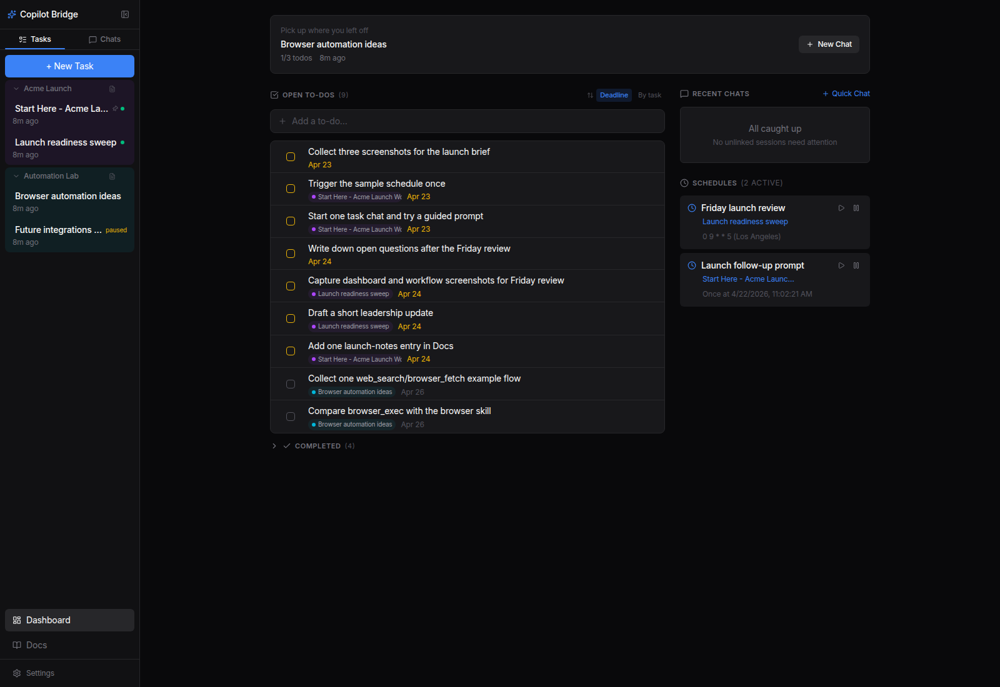
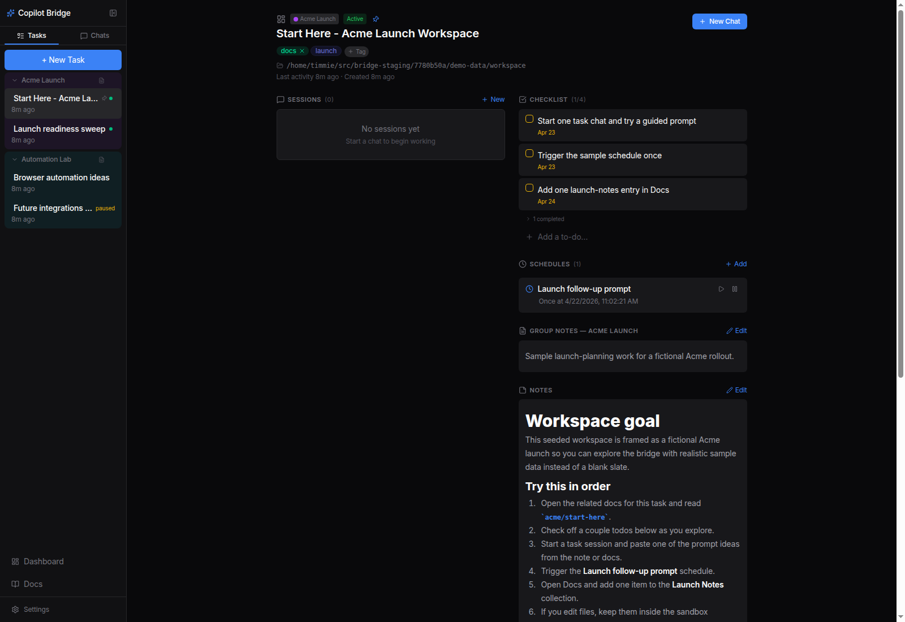
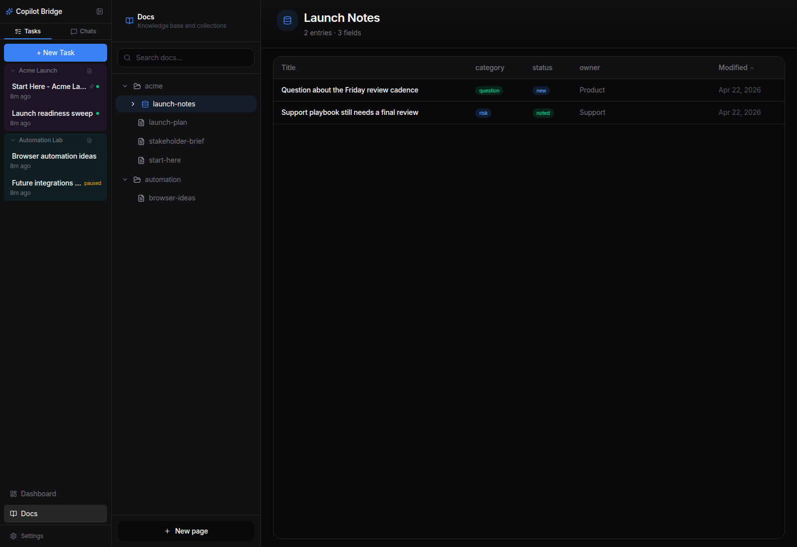

# Copilot Bridge

Copilot Bridge is a local, task-centric AI workspace built on the GitHub Copilot SDK. It combines persistent Copilot sessions, tasks, notes, docs, schedules, linked work, and tool-rich automation in one opinionated app.

This repo is intentionally personal. The goal is not to build a generic SaaS product, but to shape an AI workspace around how one person actually works and then keep iterating on it.

## Screenshots



<table>
  <tr>
    <td width="50%">
      
    </td>
    <td width="50%">
      
    </td>
  </tr>
  <tr>
    <td><strong>Task workspace</strong> — notes, checklist items, schedules, and linked context stay attached to the work.</td>
    <td><strong>Docs collection</strong> — markdown pages and database-style collections live in the same workspace.</td>
  </tr>
</table>

## Why It Is Interesting

- **Task-centric instead of chat-centric** - sessions live next to notes, checklist items, schedules, docs, and linked work.
- **Persistent local workspace** - SQLite-backed app state plus a markdown knowledge base means work survives restarts and browser refreshes.
- **Large tool surface** - the agent can manage tasks, tags, checklist items, docs, schedules, browser sessions, web search, and optional desktop automation from inside the same workspace.
- **Built to improve itself** - launcher-managed restart, update, staging preview, and rollback flows make local self-iteration practical.

## What It Does

- **Native Home** (`/dashboard/home`) - what needs you (questions, stalled conversations, reached revisit dates), tasks to pick up, source-linked new replies, tasks gone quiet for 30+ days with Finished/Not doing it/Later/Still active outcomes and Undo, and a date-grouped checklist. Task states are derived from task momentum, what Tim does (editing a task or writing in its conversations; opening or reading never counts), conversations and automation; never from read markers or checklist items. **All tasks** (`/dashboard/tasks`) groups every active task by state or group with bulk tidy actions. Home does not create a parallel Work/Commitment/Result system, mark conversations read merely by showing an excerpt, or infer completion from an idle session. The normal task/chat/tool experience remains authoritative.
- **Where things stand** - optional Next step, Waiting for and Revisit on context belongs to the existing Task. The task panel starts collapsed with a one-line summary; expand it to edit. Defer/Resume stays visible, and changing tasks resets the disclosure. Waiting does not imply that all work is blocked, and a revisit is not a deadline or notification. Ongoing tasks need neither a finish line nor constant activity. **Defer task** moves a task to Set aside without archiving or muting it: a collapsed section below the sidebar list and at the bottom of All tasks, and out of Home's working sections. An optional revisit date brings it back under Needs you for review, not automatic resumption or execution; questions and stalled conversations do too, and the Set aside header says when one of its tasks needs you or holds unread conversations. Once the date arrives the task also shows in the sidebar's working list, marked Revisit with the paused glyph (the tooltip says "Deferred · ready to revisit"), and the task opens with a **Time to revisit** prompt: Resume task (which clears the date), Later (tomorrow or next week at 9:00, or a chosen time) or Clear date; Home's Needs you row offers the same choices. A reached revisit date surfaces a muted task the same way, while mute keeps silencing its questions, stalls and replies. Unread replies and checklist deadlines retain their normal visibility. Deferring never pauses running sessions, schedules or session defer jobs. Resume is explicit; changing task context alone does not resume it. Archive/completion clears deferral and marks the task's conversations read (those not archived themselves and not held by another active task), so a reply or question that arrives afterwards is new: Home lists it labelled as an archived task, and the sidebar's Archived header counts it. The existing `task_update_momentum` tool accepts `deferred` and still requires an explicit `followUp` set/keep/clear decision. Every change to these fields (from the UI, an agent session or a schedule run, including implicit clears on archive) is recorded in `task_momentum_events`: the task panel shows who changed it last and opens to the recent history, archived tasks keep that history, and `GET /api/tasks/:id/momentum-events` returns it. Stored values are 500-character previews, and each task keeps its newest 200 changes. The task list no longer repeats the next step under each task.
- **Dashboard retirement history** (`/dashboard/archive`) - the former Alert/Decision/Event/Feed system is read-only history, not ongoing attention. Its publishing/governance/protection tools and active APIs are retired. A preboot process-host migration preserves source rows and referenced task titles, moves checklist retry/provenance metadata into checklist-owned storage, and makes a pre-retirement database recovery backup. Existing schedules/instructions are not silently edited or disabled; the archive manifest lists references to retired publishers. Restore a backup deliberately if a data rollback is required; keeping old raw tables is not a substitute for accounting for new writes after an upgrade.
- **Task workspace** - tasks, task groups, tags, notes, checklist items, linked sessions, linked work items, linked pull requests, and task dashboards.
- **Persistent Copilot sessions** - quick chats and task-scoped chats with SSE streaming, unread state, drafts, and archive support. Archiving or restoring many chats is one operation: the multi-select in the chat list, `POST /api/sessions/batch`, and the agent tool `session_archive` each announce the whole change once, so open clients fetch the lists once instead of once per chat. `session_archive` leaves a chat alone, and says so, when it is running, waiting on the user, or has deferred work or an undelivered result pending (archiving cancels both). The model's thinking streams live and is kept in history: it is read from the `reasoningText` the runtime persists on each assistant message, so it needs no extra model setting and survives reloads. Everything the agent did between two replies (its thinking and its tool calls, in order) folds into one line such as "Worked for 2m 14s · 14 steps" that opens into a timeline; while the run is live that line names the step in flight. Tool calls read as what they did ("Read client/App.tsx", a shell call's own description with its command beside it) and keep the raw tool name, arguments and result one click away.
- **Starting a separate chat** - agents use `session_start` to open a persistent, user-visible Bridge chat and send its first prompt. Use it for work the user will open or continue in that chat; use `task` sub-agents for bounded delegation whose answer belongs in the current chat. The first prompt must be self-contained: conversation history is not copied. An explicit `taskId` supplies the task's instructions and workspace and links the chat before its first prompt; without it, the chat is unlinked and uses the default workspace. The model and other launch settings use the user's configured defaults unless overridden, not the invoking chat's settings. The tool returns the chat ID, canonical link and a Markdown link to include in the reply after the first prompt is accepted, not when the work finishes. Results and questions stay in the new chat; there is no completion report back to the originating chat. A failure after creation includes the chat's link and whether the task was linked or prompt acceptance was unconfirmed, so the agent can report the existing chat rather than duplicate it.
- **Continuing an existing chat** - agents use `session_send` with an exact chat ID and a self-contained message, not `write_agent` (which messages sub-agents). It restores archived chats, starts a new turn in idle chats, or steers an active turn without changing the target's task, workspace, model or history. It returns an acceptance/steering receipt and a Markdown link, not the target's answer; results and questions remain in that chat. A message blocked before dispatch by a Bridge hold, reconnect, stall or capacity limit is saved in the existing persistent chat-message outbox and reported as `queued`, not delivered. A repeated invocation finds its queued record rather than sending again. Once dispatch has been attempted, a failure reports acceptance unconfirmed rather than queueing a possible duplicate. A target waiting on a question or form is left alone and its link returned; a normal message is not a form response. The current chat, missing targets and slash commands are rejected. API and Helm share the delivery helper but retain their existing queue and send behavior.
- **Sub-agents** - work handed to agents is counted apart from the main agent's ("Worked for 44m · 12 steps · 7 agents, 585 steps") and opens onto one row per agent for each stretch of work, however the agents' steps were interleaved. A stretch that only handed work out reads "Launched 3 agents", and one that only agents worked in reads "3 agents worked for 6m". The row where an agent was launched carries its brief, its answer and the totals for its whole run; a call about an agent names it ("Waited on moves-agent") instead of showing its id. While the main agent has stopped to wait, the live line says "Waiting on 4 agents" rather than following whichever agent stepped last. A bar above the transcript lists the background agents, working ones first, with what each is doing and how long it has worked; a row opens onto the agent's latest report and brief, and stops the agent after a confirmation. On a phone the list is a sheet. Every history read carries one record per agent the session has run, so a step is filed under its agent even when the launch is far above the part of the log that was read.
- **Large-history reads** - latest-page statistics reuse a durable incremental fold. Every event-log reader (statistics, older pages, model-state fallback, event lookup) shares one byte-level record reader that joins each split record once instead of repeatedly copying its growing prefix. The latest page reads only the end of the log, and matches the same entries of a whole-history read exactly: the fold saves the transform's transcript cursor (turn and sub-agent tracking, undo boundary, pending completion) at each change, and the tail keeps every event's envelope for fork boundaries. If the needed cursor has been pruned, the read falls back to the whole log. Older pages and whole-history reads stream the log and keep only the envelope of events the transcript never reads, so large assets and permission payloads are not held in memory. Parsing still runs on the server thread and older pages still read the whole log.
- **Knowledge base** - markdown pages, wikilinks, preview sheets, and database-style collections for structured notes. In chat, `[[page-path|title]]` and `[title](bridge://doc/page-path)` open a read-only doc preview without replacing the conversation or draft. Links inside the preview stay in the sheet, with a Previous preview action. Close, Escape, or browser Back returns to the chat; Open full opens the Docs reader with Back to chat and restores the chat's reading position. Modified clicks retain normal new-tab behavior under the deployment base path. Agents receive this link syntax on session creation and resume, with instructions to verify a page exists before linking it.
- **Schedules** - cron or one-shot prompts that create fresh task-linked sessions. A run is recorded only after the runtime accepts its prompt. Pre-delivery failures release the scheduled slot for retry instead of consuming it or reporting a successful trigger.
- **Deferred work** - a chat can schedule a one-time or recurring check (`defer_create`); each check runs in a temporary worker session and reports back with a message to the chat only when it has something to say. A check, or a message for a chat, is counted as a try only when the work itself failed. While the Bridge cannot take it (no free Copilot context, the chat is busy, the backend is starting or restarting) it stays due, uncounted and without limit, and the Deferred work sheet shows the reason. A one-time check or a message gives up after five failed tries, and the chat is told. A recurring check keeps its schedule when a check fails: the failed check counts as a run, the chat is told once after three failures in a row, and the defer ends only when it is cancelled, finishes, or reaches its run limit or expiry. A check still running after 30 minutes is stopped and counts as failed. **Reactivate** restarts a stopped defer in one step; for a finished defer whose result never reached the chat it sends that result again.
- **Provider enrichment** - optional Azure DevOps, GitHub, and Linear integrations for richer work item and pull request cards.
- **Tool-rich automation** - built-in task/doc/schedule tools, web search, browser fetch/exec/session tools, and optional desktop computer use. Computer use is the Computer Use plugin that ships with the Copilot SDK, loaded per session when Settings > Integrations > Computer use is on. First-prompt tool initialization is shared by runtime handle and must finish before sending. Slow discovery at 30 seconds reports progress, not failure; the hard readiness budget covers both bounded backend RPCs. Failed initialization never counts as ready. Timing and outcome are recorded as `session.tools.initialization` telemetry spans.
- **Eager tool definitions** - every Copilot session is created and resumed with tool search disabled, including helpers, scheduled/defer work, and custom agents. Available MCP and external tools are supplied up front rather than hidden behind discovery; the policy survives model changes and is inherited by subagents. Existing server selections, tool allowlists/exclusions, and permission policies still apply. This increases prompt/context usage for tool-rich sessions. Existing conversations pick up the policy when their runtime handle is resumed after deployment; native tests verify actual model request payloads with more than 30 tools, not just configuration flags.
- **Workspace customization** - model, reasoning effort, agent identity, custom instructions, theme, favicon, and MCP server registry from the UI.
- **Moving chats to another model** - "Move existing chats to another model", a closed line under Settings > Chat > New chats, switches every chat that is not archived from one model to another, for when a model is replaced. The same move is available to scripts; see [Moving chats to another model](#moving-chats-to-another-model).
- **Session details** - a compact chat bar shows MCP connections, context usage, and session cost. Expand it for a full-width details panel with current context usage and headroom. Token breakdowns and provider capabilities stay under Usage details; there is no context-history graph, turn inspector, or context-event list. MCP failures, pending connections, and sign-in actions open automatically. The MCP status endpoint owns the client snapshot; stream, login, and reload events request a refresh rather than overwriting it. While the chat is visible, connection observations refresh every 30 seconds independently of tool readiness (every 2 seconds during initialization), on window focus, and through Refresh. Pending/unknown stream observations are probed immediately; unresolved probe results are cached for only 2 seconds to bound request bursts. Repeated pending startup events cannot discard an in-flight probe, while newer resolved changes and authoritative empty lists remain protected. No status read resumes a cold session. Compact rows show the last check time; exact timestamps, provenance, and session IDs remain in tooltips and the API. Settings use the newest observation rather than cache insertion order, and replayed observations are never fresh. Tool readiness remains separate (`initializing`, `ready`, `failed`, or null); initialization failures retain their cause and are not silently retried. Connection status does not establish tool authorization or request validity. Recent tool failures distinguish resource-denied/403 permission failures, expired authentication, invalid input, and query/server failures (including Kusto assertions wrapped in 400 responses); none is treated as a connection outage or triggers automatic reauthentication. A call the runtime refused because the server was still connecting and its saved tool list could not be confirmed ("MCP tool catalog changed before tool ...") is reported as `catalog-changed`: the call was not sent, and repeating it is safe. Stale MCP runtime-session recovery is limited to transport failures. Context telemetry remains available through the API and retained in SQLite until session deletion; only the historical inspection UI is removed.
- **Remote-friendly local deployment** - dev tunnels or your own ingress, optional startup webhooks, and canonical public URL support for previews.
- **Helm** - Bridge's orchestration manager (`/helm`), inside the normal layout next to your tasks and chats. Ask what needs you, hear what finished, read replies, answer a session's question, hand work to sessions on stronger models, and keep tasks, schedules, checklists and docs tidy. Helm only coordinates: it has Bridge's management tools and nothing that edits code, browses or deploys, and it uses GPT-6 Luna by default when available, with fast-model fallbacks (choose another in its settings).
  - **Chat or hands-free, one conversation** - Helm uses the same chat view as every session (streaming, drafts, chat mic, model switcher). **Hands-free** is a mode of that conversation, not a separate assistant: voice turns run through the same session, so you can switch in and out mid-thought without losing context, and everything said out loud is in the transcript. While hands-free is on, typed messages are answered out loud too, details that are awkward to hear are shown in chat instead of spoken, and a small pill keeps it running while you open the session or task Helm pointed you to.
  - **Long speech stays complete** - recordings and long hands-free turns use recognition chunks capped at 20 seconds, including padding, even when steady noise hides pauses. This prevents the recognizer dropping whole sentences from oversized input.
  - **Hands-free from a phone app** - an HTTP voice client that reconnects to the same voice conversation within its 60-second grace is sent, again, every part of the current reply it has not started playing (the hello says `resendsAudio`); the web page keeps its own scheduled audio and is not. Short transcripts that repeat the assistant's own recent words ("One sec.") count as echo, not barge-in, and the spoken lead-in waits 3 s (or a slow tool call) before playing. While a reply is still being worked out, a long silence is broken by a short "Still working on it."-style line: 8 s after the last thing said, then after 12, 20 and every 30 s of further silence, never over the user's own speech and never once the reply is complete (`progress` lines in the voice log). A quick tool-less model (Helm's preferred fast model at `low` effort, one throwaway helper session per connection) writes a lead-in that names what Helm is looking up ("Let me check the car task."), usually in about 1.5 s, or stays silent; it never answers or claims anything was done, and the canned lead-in covers it when it is slow. The canned lead-in waits one more second, to 4 s, while a written one is still on its way. Helm's own session and the lead-in helper switch the runtime's built-in GitHub MCP server off (`disabledMcpServers`): they can use none of its tools, and the runtime otherwise connects it on the first prompt of every call, which held that prompt back by more than a second (measured 6 Oct 2026: first prompt after a cold resume 2.2 to 2.5 s with it, 0.85 s without).
  - **Finding things by topic and knowing your names** - Helm's `find` tool searches task titles and notes, session titles and chat messages, and the knowledge base, retrying with any of the words when no result has them all (`docs_search` does the same and says `matchedAnyWord`). `read_session` on a busy session reports its progress (how long, its last tool steps, what it is thinking about). Sessions a schedule started say so. **Names Helm should know** in Helm settings is a free-text list of machine, project and app names (and how they sound); Helm gets it in its instructions and, when it changes, with the next hands-free turn. When hands-free starts again within five minutes of the last connection ending, the first thing you say reaches Helm with a note about the gap and its last reply, so it can repeat what you missed. A bare "okay" or "got it" gets no spoken answer.
  - **Each mode thinks at its own effort** - typed turns use `max` reasoning effort and spoken turns `none` by default (Helm settings → Thinking effort), because a reply you read can take a few more seconds than one you wait for in silence (at `xhigh`, spoken replies took 5.3 s at the median to start; on gpt-6-luna a model step takes about 1.4 s at `none` and 3.1 s at `medium`). A spoken request to start, send or change something thinks at least at `medium`, because below it Helm acted on an ambiguous task name instead of asking which one. Helm switches the session's effort at the start of each turn, only when it changed, so both modes still share one conversation. Anything answered out loud counts as spoken, including a message typed while hands-free is on; a level the model lacks falls back to the nearest one below it.
  - **Native Bridge references** - agents link Bridge's own things as `bridge://session/<id>`, `bridge://task/<id>` and `bridge://doc/<path>` (plain app routes work too). Any chat renders them as chips with live status (waiting on you, running, unread) that navigate in-app; a link alone on its line becomes a card.
  - **One set of Helm settings per Bridge** - model, both thinking efforts, names, voice, speed, patience, interruptions, announcements, and the browser's echo-safe and connection choices are saved on the Bridge (not in the browser), so Helm on the web and Tether use the same values. `GET /api/helm/settings` returns `{schemaVersion: 1, settings, voices, models}`; `PATCH` takes any subset of the eleven fields and rejects unknown or invalid ones (speed 0.75–1.4, patience 0–1, a catalog voice, an enabled model or `""` for Auto). When models cannot be listed, `models` is left out and `modelsError` says why. `GET /api/helm` carries `settingsSchemaVersion: 1`, so Tether knows to let the Bridge's saved voice settings apply. A model applies to new conversations, efforts to the next turn, voice settings to the next Start. Preferences an older version kept in the browser are not carried over.
  - **Easy to reset, still resumable, never eternal** - **New** starts a clean conversation and keeps the old one in history. Helm opens fresh after 6 idle hours with a one-click way back to where you left off. Conversations stay resumable for 14 days (at most 25), then expire unless you keep them. They live in Helm's own history rather than the chat lists.
  - **Voice pipeline** - speech detection, Smart Turn end-of-turn detection, Parakeet speech recognition, and Kokoro voices run locally in an isolated engine process; only text reaches your Copilot model. Barge-in, sleep and the "Hey Bridge" wake phrase, spoken lead-ins while tools run (the first spoken clause is at most 45 characters and speech synthesis gets half the CPU threads, so audio starts sooner), and announcements when sessions Helm dispatched finish. Audio streams over WebSocket, falling back to HTTP POST + SSE for tunnels and proxies that block upgrades. Per-conversation JSONL logs live in `data/voice/logs`. `/voice` redirects to Helm.
- **Local speech engine** - one on-demand install (~920 MB of pinned, digest-verified packages and models in `data/voice`, override with `BRIDGE_VOICE_DIR`) from **Settings → Voice** or the first time you go hands-free in Helm. It powers both Helm's hands-free mode and the chat mic: where WebCodecs Opus is available (Chrome, Edge, desktop Firefox, Safari 26+), the browser encodes mono capture at 32 kbit/s as Ogg Opus while retaining a 16 kHz WAV fallback: about an eighth of the upload. Opus is lossy, so transcripts can differ slightly from WAV. Unsupported or failed encodings use WAV, and `BRIDGE_TRANSCRIPTION_OPUS_UPLOADS=false` disables compression for new recordings. Encoding uses a 48 kHz capture clock to preserve codec delay and exact recording length; then the engine transcribes recordings on the CPU with Parakeet v3 (25 European languages, automatic punctuation), split at pauses so long clips never hold up a live conversation. A recording can run for 5 minutes (`BRIDGE_TRANSCRIPTION_MAX_DURATION_SECONDS`): the composer shows the clock against that limit and, on reaching it, stops and submits what it has. The engine process starts on first use, loads only the models a feature needs, and exits after 10 idle minutes.
- **Speech engine setup on locked-down hosts** - the npm packages are fetched with the machine's own npm client (`npm pack`), so a private registry and its credentials, proxy and CA settings apply exactly as they did when Bridge itself was installed; the models come over HTTPS from GitHub Releases and Hugging Face. Everything is checked against a pinned digest whichever way it arrives. A host that can reach neither source can still be set up: copy the archives into `data/voice/downloads` (`npm pack <name>@<version>` produces the package files) and run setup again, which uses them without touching npm or the network. A failed setup names the file, the real reason (npm's error code or the connection error behind "fetch failed"), and those by-hand steps. If Node itself cannot connect because of a required proxy or TLS inspection, start Bridge with Node's own switches for that: `NODE_OPTIONS=--use-env-proxy` or `--use-system-ca` (Node 22.21+), or `NODE_EXTRA_CA_CERTS`.

## Architecture

```
┌────────────────────────────────────────────────────┐
│ Launcher (src/launcher.ts)                         │
│ - Supervises server + optional dev tunnel          │
│ - Handles self_restart / self_update               │
│ - Performs build, health checks, rollback          │
├────────────────────────────────────────────────────┤
│ Express server (src/server/)                       │
│ - REST API + SSE streams                           │
│ - Copilot SDK session manager + custom tools       │
│ - SQLite stores (tasks, schedules, settings, etc.) │
│ - Docs KB, browser tools, staging tools            │
├────────────────────────────────────────────────────┤
│ React client (src/client/)                         │
│ - Dashboard, task rail/panel, chat, docs, settings │
│ - React Query + streaming UI                       │
│ - Mobile-friendly touches like pull-to-refresh     │
└────────────────────────────────────────────────────┘
```

## Getting Started

### Prerequisites

- Node.js 22+ (uses `node:sqlite`)
- GitHub Copilot access, authenticated through `BRIDGE_COPILOT_GITHUB_TOKEN`, GitHub CLI, or a [Copilot CLI](https://github.com/github/copilot-cli) login
- [Dev Tunnel CLI](https://aka.ms/devtunnels) (optional, for remote access)
- Optional provider config for Azure DevOps, GitHub, or Linear if you want enriched work items and pull requests
- Optional desktop computer use, turned on from Settings > Integrations on a trusted local machine

### Install

```bash
git clone https://github.com/timstewartj/copilot-bridge.git
cd copilot-bridge
npm install
cp .env.example .env   # Edit .env with your settings if needed
```

The launcher and direct server entrypoint load `.env` automatically at startup. Existing exported environment variables still win over values from the file.

For Copilot SDK authentication, set `BRIDGE_COPILOT_GITHUB_TOKEN` if you want Bridge to use a dedicated token and skip stored-login/`gh` fallback. Leave it empty to keep the SDK default auth discovery, including GitHub CLI fallback. Bridge uses that same SDK auth to host GitHub MCP `web_search`, so no PAT or separate OAuth app is needed for the built-in web-search path.

GitHub work item and pull request enrichment reuses the same ambient auth: `BRIDGE_COPILOT_GITHUB_TOKEN`, then `GH_TOKEN`, then `GITHUB_TOKEN`, then `gh auth token`. With no token available it still enriches public repositories anonymously. Fully qualified references (`owner/repo#123`, an issue/PR URL, or an `owner/repo` PR repository) work without any GitHub provider settings; the optional owner/default-repo settings only resolve short references like `123` or `repo#123`.

### Copilot Runtime

Bridge uses `@github/copilot-sdk` 1.0.18 and launches the pinned `@github/copilot` CLI (1.0.94 stable) through its npm
loader, so a CLI release can be validated independently of the SDK's bundled runtime (also 1.0.94). Install optional dependencies
(the npm default) so the platform-specific CLI and SDK packages are present; no separate CLI runtime override or
wrapper is needed. The SDK natively forwards GitHub MCP configuration, structured `ask_user` elicitation, and Bridge
tool-loading metadata.

Automatic tool approvals are configured once per runtime handle using the CLI's native permission
mode, before tool initialization or prompt delivery. Bridge no longer answers each approval through
an SDK callback. Native policy refusal or initialization failure stops delivery explicitly; managed
restrictions and content exclusions remain runtime-enforced. Agent questions and Computer Use
confirmations keep their existing flows, and cloud-backed agentic memory stays disabled.

HydraFusion uses the runtime's native orchestration, with its startup feature flags enabled and experimental
mode supplied on session creation and resume. Sessions select `hydrafusion` directly, without first creating
a different model's session. Reasoning effort and context tier are chosen by HydraFusion rather than fixed
in Bridge. This is a research preview; its native feature flags are tied to the pinned CLI version.

### Packaged Release Mode

For teammate installs that should not require git history, build a release bundle:

```powershell
pwsh -NoProfile -File .\scripts\package-release.ps1 -IncludeNodeModules
```

That creates a `release\copilot-bridge-<version>-stable-win-x64.zip` package with root-level `start.ps1`, `stop.ps1`, `update.ps1`, `install-startup-task.ps1`, and `uninstall-startup-task.ps1` scripts plus their shared `release-common.ps1` helper. Release mode starts the compiled launcher from `dist\launcher.js`, skips startup `git pull`, disables git-backed self-update/staging tools, and stores durable state outside the app folder.

Use `-IncludeNodeModules` for teammate installs and update packages. It installs only the packaged server's runtime dependencies into `app\node_modules` instead of copying the full repository dependency tree, including the SDK's optional platform-native runtime package. Packages built without `node_modules` are source-light bundles for manual installs only; `update.ps1` rejects them because it cannot safely start and health-check the new app without dependencies.

The packaging script writes a standard `.sha256` sidecar. Use `-Analyze` to generate package size/layout analysis, and `-SmokeTest` to validate the extracted package. When `-SmokeTest` is combined with `-IncludeNodeModules`, it starts the package with isolated temporary state, verifies `/api/health`, and stops it again:

```powershell
pwsh -NoProfile -File .\scripts\package-release.ps1 -IncludeNodeModules -Analyze -SmokeTest
```

For remote updates, `update.ps1 -DownloadUrl` requires an HTTPS URL and a matching `-ExpectedSha256` so the downloaded package is verified before install. Local `-PackagePath` updates can omit the hash, though providing one is still recommended.

GitHub Releases are the canonical release record for tags, release notes, release assets, and signed channel manifests. In-app updates use GitHub Release assets as the default machine-download source and verify a signed manifest before trusting any package URL or SHA. GitHub Actions artifacts are temporary CI outputs only, not the release distribution channel.

The `CI` GitHub Actions workflow validates pull requests and pushes. The `Preview Release` workflow runs automatically on pushes to `master` or `main`, generates a preview version such as `0.1.0-preview.184.1.g09b2447`, builds a runnable `preview` package, uploads workflow artifacts, publishes the package assets to an immutable `preview-<version>` prerelease, writes a signed `preview-win-x64.manifest.json` whose package URL points at that immutable prerelease, and updates the rolling `latest-preview` prerelease with the manifest/signature pointer, a PowerShell bootstrap installer, and a stable `copilot-bridge-preview-win-x64.zip` alias. Preview builds are installable, but they are not stable releases.

For first-time preview installs, use PowerShell:

```powershell
irm https://github.com/TimStewartJ/copilot-bridge/releases/download/latest-preview/install-preview.ps1 | iex
```

The installer requires Node.js 22+ on PATH or `BRIDGE_NODE_PATH`. It downloads the signed preview manifest, verifies the manifest signature, downloads the immutable package listed in that manifest, verifies the package SHA256, installs app files under `%LOCALAPPDATA%\Programs\CopilotBridge`, keeps durable data under `%LOCALAPPDATA%\CopilotBridge`, and starts Bridge. The stable zip alias is for manual download only; the signed manifest remains the trusted update source.

The `Release` GitHub Actions workflow is for official stable builds. It runs on demand, validates the app, calls the packaging script, uploads temporary workflow artifacts for inspection, writes a signed `stable-win-x64.manifest.json`, and can create a draft GitHub Release with the zip, SHA256 sidecar, package analysis, manifest, and detached signature. Use the draft release assets for distribution after reviewing the generated notes and package analysis.

Signed update manifests require an Ed25519 key pair. Generate one with:

```powershell
node .\scripts\generate-update-signing-key.mjs
```

Store the private key in GitHub Secrets as `BRIDGE_UPDATE_MANIFEST_PRIVATE_KEY_PEM`. Store the public key as a GitHub Actions variable or secret named `BRIDGE_UPDATE_MANIFEST_PUBLIC_KEY_PEM`; release packages embed that public key as `app\update-manifest-public-key.pem` so packaged installs can verify future update manifests. The app also supports `BRIDGE_UPDATE_MANIFEST_PUBLIC_KEY_BASE64`, `BRIDGE_UPDATE_MANIFEST_PUBLIC_KEY_PATH`, `BRIDGE_UPDATE_MANIFEST_STABLE_URL`, and `BRIDGE_UPDATE_MANIFEST_PREVIEW_URL` for explicit release config overrides.

Packaged installs expose **Settings > System > Release updates**. The app checks the stable or preview manifest, verifies its detached signature, and only then enables **Install and restart**. The install endpoint accepts only a channel, never an arbitrary URL from the browser. It re-checks the signed manifest server-side, launches the packaged `update.ps1` in a detached PowerShell process, downloads the verified zip, checks SHA256, stages an inactive release slot, refreshes wrapper scripts with backup/restore protection, queues launcher activation, and writes status to `data\update-status.json`.
Default release state lives under `%LOCALAPPDATA%\CopilotBridge`:

```text
%LOCALAPPDATA%\CopilotBridge\
  data\       # tasks, sessions, docs, settings, schedules
  config\     # release .env
  logs\
  backups\
```

The release boundary is intentional: app files can be replaced during updates, but user data stays in the per-user state folder. Use `BRIDGE_STATE_ROOT` to move that whole state root, or set `BRIDGE_DATA_DIR`, `BRIDGE_DOCS_DIR`, and `COPILOT_HOME` in `%LOCALAPPDATA%\CopilotBridge\config\.env` for finer control. Custom release paths must be absolute.

Changing launcher-owned release settings after the release launcher is already running requires a full `stop.ps1` then `start.ps1`. This includes `BRIDGE_DATA_DIR`, tunnel/webhook settings such as `BRIDGE_TUNNEL_NAMES` and `BRIDGE_WEBHOOK_URL`, and launcher log paths. Server-child config values can be reloaded with `self_restart`.

The launcher hosts the persistent dev tunnels listed in `BRIDGE_TUNNEL_NAMES` (comma or space separated); with the setting empty or unset it hosts none, for example when you use your own ingress. It keeps each tunnel running across server restarts and restarts it with bounded backoff after process or public-health failures. The first name is the primary tunnel: its URL is published for staging links and notifications. Create a tunnel once with `devtunnel create <name>` and `devtunnel port create <name> -p 3333` before listing it. Access-controlled tunnels (for example after `devtunnel access reset <tunnel>` to require sign-in) are supported: the public health probe treats the relay's sign-in redirect as "reachable" rather than as an outage, so the tunnel is not recycled for being private. An older `.env` with `BRIDGE_TUNNEL_NAME` (and optionally `BRIDGE_ENABLE_TUNNEL=false`) keeps working until `BRIDGE_TUNNEL_NAMES` is set, and the launcher logs that it is deprecated.

Dev Tunnels sends a visitor to one sign-in provider per tunnel, so mixing Microsoft and GitHub rules on one tunnel sends browsers without a cookie to the wrong sign-in page. To offer both, list two tunnels, each with one kind of rule. Each additional tunnel gets its own `tunnel-runtime-<name>.json` state file. The Bridge has no sign-in of its own, so each tunnel's access control is the whole security boundary.

A tunnel owned by a GitHub account can run next to tunnels owned by the devtunnel CLI's login: list it as `github:<name>`. The CLI holds one login at a time, so instead of using it the launcher reads the github.com credential that Git Credential Manager (or another git credential helper) stores for HTTPS, asks the Dev Tunnels API for a host token for that tunnel, and runs `devtunnel host <name>.<cluster> --access-token -` with the token on stdin. Host tokens last about 24 hours; the launcher fetches the next one an hour before expiry and restarts the host with it, a gap of a few seconds. Prompts are disabled, so if the credential is missing or revoked the launcher logs why and retries; sign in once with a git command over HTTPS to github.com to fix it. With owner-only access, only that GitHub account can open the tunnel. To create one, run `devtunnel user login -g`, `devtunnel create <name>` and `devtunnel port create <name> -p 3333`, then log the CLI back in to the account that owns your other tunnels.

To start the packaged release automatically when you sign in, run this from the extracted release root:

```powershell
.\install-startup-task.ps1
```

That registers a per-user Windows Scheduled Task that runs `start.ps1` at logon. It does not require admin rights for a normal per-user task. If you use a custom `BRIDGE_STATE_ROOT`, set it before installing the task or pass it explicitly:

```powershell
.\install-startup-task.ps1 -StateRoot "D:\BridgeState"
```

When you pass `-StateRoot`, the release root records that state root so `start.ps1` and `update.ps1` use the same durable data location.

If `.bridge-state-root` already exists, `update.ps1` and `install-startup-task.ps1` refuse to switch to a different `BRIDGE_STATE_ROOT` implicitly. Remove or edit `.bridge-state-root` intentionally before changing the active state root.

To remove the startup task later:

```powershell
.\uninstall-startup-task.ps1
```

### Run (Development)

```bash
npm run dev          # Launcher + server + tunnel/webhook support
npm run dev:server   # Server only
npm run dev:client   # Vite dev server with HMR
```

On Windows, `.\scripts\start-bridge.ps1` launches the durable outer supervisor
in the background; `-Wait` keeps the caller attached for Scheduled Task setups.
`.\scripts\stop-bridge.ps1`
writes an intentional-stop sentinel before terminating this checkout's process
tree, so the supervisor will not relaunch it. It stops the tree's roots before
their descendants, so nothing respawns mid-stop, and verifies process identities
against one process snapshot per pass. A normal
`.\scripts\start-bridge.ps1` explicitly clears that sentinel; to resume in
supervised mode, use `.\scripts\start-bridge.ps1 -Wait -ClearIntentionalStop`.

The bridge server listens on port `3333` by default. To use a different local app port, set `BRIDGE_PORT` in your shell or `.env` file before starting the launcher/server:

```bash
BRIDGE_PORT=4444
```

### Fastest Path to Value

If you are opening the bridge for the first time, keep it simple:

1. Run `npm run dev` to start the local workspace.
2. Go to **Settings** and pick your model, reasoning effort, theme, and favicon.
3. Skip Azure DevOps/GitHub/Linear setup for now if you want a clean local workspace.
4. Create a task, add a checklist item and a note, then start a task session.
5. Open **Docs** and create a page or collection entry to exercise the knowledge base.
6. Ask the agent to do something bridge-native, like create a schedule, rename the session, or search the web.

You can get a lot of value on first run without any external work-tracking provider setup: tasks, notes, tags, docs, schedules, and local Copilot sessions all work locally.

### Response Style and Prompt Settings

**Settings > Responses** separates response style from identity and additional custom instructions. Response Style starts with **Natural and direct** guidance and **Adaptive** detail. Choose **Concise** or **Detailed** as a default, edit the guidance (up to 4,000 characters), or use **Reset to default**. Blank guidance uses the default. Settings save as they change, with Undo in the header; the guidance, identity and instruction text save when you press their own **Save**.

Each new conversational session and fresh resume receives one stable `<response_style>` block and a separate, always-included `<response_quality>` block. Explicit requests for tone, detail, or output format override style defaults. Quality guidance covers supported claims, material uncertainty, independent judgment, and accurate reporting of research, changes, and tests; it is not disabled by style settings. Specialized machine-output workers keep their own prompts. Saving does not interrupt active or cached sessions; a cached chat picks up changes when its runtime handle is freshly resumed.

The unmodified `<anti_slop_response_quality>` block previously added to Custom Instructions is normalized into the new defaults without duplicating it in the prompt. Saving settings persists the migrated fields. Other custom instructions and explicitly configured response styles are preserved. Edited or incomplete legacy blocks remain untouched and show a review notice in settings.

The settings API accepts `responseStyle: { detail: "adaptive" | "concise" | "detailed", guidance: string }`. Omitted fields within a supplied object use their defaults; `{}` resets the style. Unsupported keys, invalid types or detail values, and guidance longer than 4,000 characters after trimming are rejected without changing settings.

### Validate

```bash
npx vitest run <file> # targeted dev test
npm test              # full Vitest regression suite
npm run check:fast    # x-plat audit + design audit + client/server/package type-checking
npm run check:client  # design audit + client type-check + client lane
npm run check:server  # server type-check + server/shared lane
npm run check:packages # server + per-package type-check + in-tree package tests (src/packages)
npm run check:integration # type-check + API, workflow, persistence/lifecycle, and native process tests
npm run check:launcher # server type-check + launcher lane
npm run check:staging # server type-check + staging tooling lane + native process tests
npm run check:native  # server type-check + native process tests only
npm run check:browser # live view, upload, screenshot, drag and download against the installed agent-browser and a real browser (not part of check:pr)
npm run check:pr      # fast gate + all lanes + full build
npm run check:deploy  # PR gate + preview smoke
npm run test:slow-report # full Vitest pass + top slowest files
```

Use `check:fast` during day-to-day editing, then run the area-specific `check:*` lane that matches the work you touched. Use `check:pr` before asking for review or refreshing a branch, and reserve `check:deploy` for release-quality validation. Coverage is CI-owned: the GitHub Actions CI workflow runs `test:coverage` on PRs, pushes, manual dispatches, and its nightly schedule; local deploy validation still runs the full non-coverage test lanes through `check:pr`. Client type-checking (`npm run typecheck:client`) is a plain `tsc --noEmit` over `tsconfig.client.json` and must stay at zero diagnostics. Vitest forces `NODE_ENV=test` so launcher/staging validations inherited from a production process do not load production-only React test behavior.

Windows process-tree identity snapshots use `CreateToolhelp32Snapshot` and `GetProcessTimes` on a dedicated worker thread. They do not start PowerShell or query WMI/CIM. Native creation times retain the microsecond precision of persisted CIM markers. Unqueryable entries during process creation or exit are re-observed within the existing snapshot and fencing budgets. No process is signalled through an unknown identity, and unknown survivors never count as exited. Incomplete snapshots, recycled PIDs, and worker failures retain the existing refusal behavior. Snapshot, fencing, and RPC deadlines are unchanged; POSIX snapshots continue to use `ps`.

### Moving chats to another model

A move switches every chat that is not archived from one model to another. It covers the chats the
session list shows, so archived chats, Helm conversations and temporary worker sessions are left alone.
The model for new chats, schedules, deferred workers and sub-agents is a setting of its own and does not
change.

The server takes the chats one at a time, most recent first, through the same switch the model picker in
a chat uses. A chat that is not loaded is loaded for the switch and unloaded again. Each chat keeps its
reasoning effort when the new model supports it and otherwise gets the nearest level the new model has; a chat on long
context keeps it when the new model offers long context. A chat is left as it is, and reported, when:

| Outcome | Meaning |
| --- | --- |
| `busy` | A turn or another operation was in flight. |
| `needs-compaction` | The conversation does not fit the new model and `compact` was not set. |
| `changed` | The chat was no longer on the old model when its turn came. |
| `failed` | The switch raised an error or the runtime did not apply it. |

Three failures in a row stop the move (`status: "stopped"`), so a runtime that is down does not fail every
chat in turn. Running a move again only touches the chats still on the old model. One move runs at a time,
and the server keeps the last one in memory until it restarts.

| Request | Purpose |
| --- | --- |
| `GET /api/session-model-move/models` | Chats per model: `{ scannedAt, sessionCount, unknownCount, models: [{ model, sessionCount, busyCount }] }`. Reads every chat's model, which takes seconds. The count is reused for 60 seconds, by a dry run and a move as well; `?refresh=true` reads again. |
| `POST /api/session-model-move` | Body `{ fromModel, toModel, reasoningEffort?, contextTier?, compact?, sessionIds?, dryRun? }`. `dryRun: true` answers 200 with the chats that would move. Otherwise it answers 202 with `{ job }` and the move runs in the background. 400 for a body it cannot use or a `toModel` the runtime does not offer, 409 with the running `job` while another move runs. |
| `GET /api/session-model-move` | `{ job }` for the running or last move, or `{ job: null }`. The job has `status` (`running`, `completed`, `cancelled`, `stopped`), `total`, `processed`, `counts` per outcome, and `results` with one entry per chat. |
| `POST /api/session-model-move/cancel` | Stops after the chat being switched. Chats already moved stay moved. |

`reasoningEffort` and `contextTier` apply to every moved chat. `compact: true` compacts a conversation that
does not fit and then moves it, which costs a model call on the old model. `sessionIds` limits the move to
those chats; each `moved` result carries `previousReasoningEffort` and `previousContextTier`, so a script
can put the same chats back.

```powershell
$api = "http://localhost:3333/api/session-model-move"
$move = @{ fromModel = "old-model-id"; toModel = "new-model-id" }

# What would move
Invoke-RestMethod "$api" -Method Post -ContentType "application/json" -Body (@{ dryRun = $true } + $move | ConvertTo-Json)

# Move, then wait for the result
Invoke-RestMethod "$api" -Method Post -ContentType "application/json" -Body ($move | ConvertTo-Json) | Out-Null
do { Start-Sleep 5; $job = (Invoke-RestMethod "$api").job } while ($job.status -eq "running")
$job.counts
$job.results | Where-Object outcome -ne "moved" | Format-Table title, outcome, detail
```

### Pagination query parameters

The GET endpoints `/api/schedules/:id/sessions`, `/api/docs/search`, and
`/api/docs/db/*folder` validate `limit` as a positive integer and `offset` as a
non-negative integer. Negative, fractional, non-numeric, and unsafe integer values
return HTTP 400 with an `{ "error": "..." }` body; `limit=0` is invalid, while
`offset=0` is valid. Omitted parameters retain these defaults:

| Endpoint | Default limit | Maximum limit | Default offset |
| --- | --- | --- | --- |
| Schedule sessions | 20 | 100 | 0 |
| Docs search | 50 | 200 | 0 |
| Docs database entries | 10000 | 10000 | 0 |

Valid limits above the endpoint maximum are clamped. Offsets accept integers up
to `Number.MAX_SAFE_INTEGER`.

### Context and prompt-cache diagnostics

Resumes still pending at 30 seconds emit `session.resume.diagnostic` spans with
attempt/session identity, purpose, backend generation/PID, elapsed time and
connection state. One 5-second ping observes responsiveness without triggering
recovery. The unchanged 60-second timeout and eventual backend result are recorded;
`wrapperEnded` distinguishes settlement after Bridge stopped waiting (including
fencing). Fast resumes emit nothing; payloads and raw errors are excluded.
Ping success does not prove resume progress, nor timeout a deadlock. These
diagnostics cannot identify the native lock owner or guarantee a root cause.

`BRIDGE_SUPPRESS_PASSIVE_RESUME_EVENTS=true` enables a temporary workaround for
Copilot's native resume/MCP callback deadlock. It suppresses `session.resume` only
when the chat navigation warmup endpoint reconnects an idle session. Warming and
cache reuse still run; the next send uses that handle without a second resume.
The skipped event is a lifecycle/settings snapshot, not conversation history:
native resume-related side effects and metrics are omitted for that attachment.
Fork warmups, cold sends, reloads, model switches, and interrupted-run recovery
remain unchanged. This is containment, not a correction to the native locks.
The switch defaults to false; invalid values warn and leave it disabled. It is
read from the manager's runtime environment at startup. Set false/unset and
restart the server to restore normal events on subsequent warmups. Successful
`session.warm.coldResume`/`session.warm` spans include `source` and
`resumeEventSuppressed` so the selected path can be verified without payloads.

Copilot `assistant.usage` and shutdown metrics count cache reads/writes within
input tokens and reasoning within output tokens. Context occupancy uses explicit
context counts, not those per-call or cumulative usage totals. Other normalized
usage shapes retain their existing additive contract.

`session.prompt.applied` compares only accepted SDK-handle configurations, including
the latest retained applied span after restart. Warm handle reuse emits no new
applied span. Telemetry pruning removes that historical baseline; malformed or
unreadable history is marked in `previousRead`. Applied and cache-break spans carry
a process startup marker. Cache-break reasons remain hashed with category `unknown`
because the installed runtime exposes open strings, not verified reason constants.
Changed cache-field names remain counts only. Event/agent IDs are bounded, model
and agent names are hashed, and request snapshots are never recorded. API/provider
call IDs are available on usage events, not cache-break events.

### Session list

`src/server/session-list.ts` owns the list behind `GET /api/sessions`, `/api/tasks/overview`,
`/api/home` and Helm. It keeps two things apart:

- **Rows that are built** hold what changes only structurally: which sessions exist, their
  names, workspaces, plan file and log size. A build reads the CLI catalog (filtered in its
  worker thread), the session folders, and one `workspace.yaml` and two stats per listed
  session. The active list and the list that includes archived sessions are built and kept
  separately. Rows are served until something a build reads is announced (a session created,
  forked, deleted, renamed, restored from the archive, a workspace change, a task change) or
  until they are 30 seconds old; old rows are still served at once and replaced by one build
  in the background, which is how changes nobody announces (a new plan file, a growing log,
  a session the CLI created by itself) show up. A session whose creation has answered with its
  id but whose runtime has not finished has no folder yet; a build takes it from
  `SessionManager.listPendingSessionCreationIds()` as a bare row, so it is listed as soon as it
  is linked or running, and the creation's own announcement replaces or removes the row.
- **Everything else is read per response**, by session id, for the rows in hand: run state,
  questions, archived flag and time, activity and read times, task links, schedule name and
  switch, deferred work, intent. Archiving, reading, linking or scheduling therefore needs no
  build and shows in the very next response. A session that only now became worth listing is
  shown at once without its file-backed details, and that response starts one background build
  that adds them; a session builds leave without details does not ask again.

At most one build per list runs at a time. Every announcement increments a counter; a build
notes the counter before its first read, and a request is only served rows or a build whose
note is at least the counter at the request's arrival. A burst of announcements during a build
costs one more build, started when the running one ends, whoever is waiting. A request whose
client has gone is not answered.

No response and no build of the active list reads a whole table (`bridge_session_state`,
`read_state`, `task_sessions`); stores offer keyed reads for that (`listMetaFor`,
`getReadStateFor`, `listTaskLinksBySession`, `listWorkspacesFor`). This matters because the
synchronous part of a list read blocks the server's main thread, and stretches many times over
when the machine is busy. Only a list of more than 8,000 sessions, in practice the one that
includes archived sessions, scans the tables, because that is then cheaper than a lookup per id. `GET /api/tasks/:id/archived-sessions` pages the task's archived links in SQLite and
reads only the page's sessions. Anything else that asks about particular sessions (the defer
runners, schedule retention, a schedule's run list) reads those sessions' folders with
`SessionManager.readSessionsFromDisk` instead of listing all of them. The defer runners and
schedule retention, which end or prune work for a session that is gone, pass `failOnReadError`:
only a missing folder or file counts as gone, and any other read error leaves the work as it is.

Spans: `session.enrichedList.cache` (one per list read: `hit`, `stale-served`, `coalesced`,
`miss`), `session.enrichedList.build` (`stored`, or `discarded` when an announcement arrived
during it), `session.enrichedList.invalidate` (reason and which lists), `session.cliCatalog.list`,
`session.listFromDisk.enumerate`, `session.listFromDisk`, `session.workspaceNameOverlay`, and
`http.request.operation` with operation `sessions.enrichedList` (the wait for rows) and
`sessions.overlay` (the synchronous per-response work).

### Cross-Platform Test Rules

- Use the shared helpers in `src/server/__tests__/test-paths.ts` for fake homes, normalized path assertions, and fake executable paths.
- Do not hardcode Unix-only fixtures like `/tmp/...` or `/usr/bin/...` in tests.
- Do not skip Windows with `skipIf(isWindows)` when the behavior can be tested with mocks instead.
- Prefer mocking failure paths over Unix-only filesystem tricks like `chmod`.
- Name a test `*.native.test.ts` when it drives real OS process trees (PowerShell/CIM snapshots, `taskkill`, staged backend children, the Copilot CLI). Only the `native` project runs those; on Windows it runs one file at a time after the parallel projects finish.
- Wait for a completion signal (a returned promise, a settle hook, or a lifecycle callback) instead of polling for background work. When polling is unavoidable, `vi.waitFor` has a shared 20s hang-guard budget; do not tighten it for real I/O.
- Tests never see the live Bridge runtime environment: the shared Vitest config strips inherited `BRIDGE_*`, `COPILOT_*`, and GitHub token variables, so stub what a test needs with `vi.stubEnv()` or `withTestEnv()`.
- Native permission checks share one isolated CLI runtime and shut down through the SDK. A scripted loopback provider persists the conversation needed for cold-resume coverage without cloud inference; process-tree fencing is tested separately. Register async fixture cleanup with `registerTestAppCleanup`; explicit cleanup and `afterEach` join setup and shutdown before temporary files are removed. Disable implicit client startup so a timed-out test cannot restart its runtime after cleanup.
- Self-update validates in a Git-free release-slot copy. Source-management tests must model checkout metadata explicitly: use `withTestSourceCheckout()` from `test-paths.ts` in a file-local `node:fs` mock. This includes integration tests that assert retained staging tools, such as `native-home-routes.test.ts`, not just staging-specific tests. It supplies only this source tree's `.git` marker and delegates other paths; do not restore inherited runtime settings or assume host Git metadata exists. Keep release-mode assertions that those tools remain hidden.
- `staging_preview` runs `npm run check:pr` itself (and `staging_deploy` does when preview validation was skipped or invalidated), so do not run it by hand right before them. `preview:smoke` checks the staged preview/backend without re-running validation by default; use `npm run preview:smoke:full` to validate and smoke in one command.

### Design System

Every client screen is built from `src/client/design/`: `tokens.ts` holds the class recipes, `primitives.tsx` the components, and its `README.md` the rules. Opaque canvas, pane, group, inset, selection and overlay roles make loaded task lists and views distinguishable. Use one neutral group per logical region, divided unboxed rows and values, and insets for controls/raw details; never nest same-level groups or Panels. Layout and type carry hierarchy without illegibly faint text. Shadows stay on overlays, accent is never an action fill, and each screen has one primary action.

- `npm run test:design-audit` runs in `check:fast`, `check:client` and `check:pr`. Every runtime client screen is held to it: the migration backlog is empty and the legacy token module is retired.
- Never add a file to `src/client/design/audit-pending.ts`; the tests require it to remain empty. Surface tests require enabled text/state roles to reach 4.5:1, composed badge tints to remain readable, and input boundaries to reach 3:1 in both themes.
- `npx tsx src/client/design/audit.ts --explain <file>` lists what a file still breaks.

Search keeps the query/source filters fixed above a single results scroller, with plain document
excerpts and literal chat excerpts. Ctrl/⌘ K opens it from anywhere; with nothing typed it lists
unread chats, and arrow keys reach the result rows. Settings keeps long instruction fields behind disclosures,
uses a mobile category selector, and exposes live quota from the mobile header. Drafts save only
changed fields; theme selection is a reversible preview until Save, and passive model-catalog reads
do not change saved preferences or create an unsaved-changes warning.

### Build

```bash
npm run build        # Build client + server
npm run build:client # Vite build only
npm run build:server # TypeScript compile only
```

### Runtime session retirement

Each evicted handle has one retirement episode, identified by a lease and backend
generation. Bridge calls the adapter's required, single-flight `release()`; the
runtime owns task teardown. Retirement does not enumerate/cancel/remove tasks or
delete transcripts. Live task monitoring, user cancellation, and active-parent
capacity reaping remain separate.

Release waits for already-running raw task operations, not their timeout wrappers.
After five seconds without confirmed release, the handle is quarantined. New work
is held; existing runs get the remainder of a 60-second retirement budget.
Late release can clear quarantine before recycling, but timeout never clears ownership.

At that deadline the Bridge first checks that it is not itself behind on the runtime's
replies (see the rule above [Backend loss records](#backend-loss-records)), which can
add one more minute. Then `cleanup-stalled` uses the same replacement mechanism as transport
recovery and model refresh: retain owner, confirm its `fence()`, discard old handles
and reservations, then own/start the replacement. Recovery retries fencing that could
not observe or finish in time (a timed-out snapshot or observation, an exhausted
deadline, unknown survivor status, or a taskkill that ran out of time) with backoff for
up to five minutes. Processes a failed attempt may already have signalled stay
unverified: the next attempt re-checks them with one process-table read and terminates
any that are still alive before it acknowledges, because a killed parent orphans its
surviving children. Unknown ownership, unverifiable identities, and processes that
outlive their kill block recovery immediately. Failed candidate startup followed by
confirmed candidate fencing permits at most two more start attempts. A blocked recovery
publishes `agentBackend.recoveryBlockedAt`; the launcher force-restarts a server that
has reported it for 60 seconds, at most three times per hour, and only reports (log
plus optional webhook) when that budget is spent or automatic recovery is suppressed.
Shutdown can always reach the current owner.
Accepted interactive work uses the existing continuation/cooldown policy; quiet
defer turns are not automatically continued. Expiring a resume barrier also requires
fenced recovery rather than admitting another handle.

**Contract limit:** release acknowledges SDK handle ownership, not zero remaining OS
processes. Pinned SDK 1.0.13 / CLI 1.0.84-3 Linux experiments found attached children
draining for about five seconds after release, even with the former reaper or an
additional native close call. Do not infer process exit from an empty task list,
successful resume, or healthy ping.

### Agent questions

A question an agent asks with `ask_user` is shown as a form in the chat and on Home, and the
turn waits for the answer. A chat that is waiting counts as working, so it also holds a
pending restart. Bridge answers in the user's place in two cases.

A question asked while the chat is in Autopilot is answered at once and shown to nobody:
no form and no "needs input" notification. The Copilot CLI's own autopilot handling of
`ask_user` does not apply when the host shows the form, as Bridge does (measured on CLI
1.0.89), so Bridge does it.

A question nobody answers for 30 minutes is answered so the turn can go on
(`PENDING_INTERACTION_AUTO_ANSWER_MS` in `src/server/session-manager.ts`). Of 303 questions
acted on in six weeks of sessions, 295 were reached within 30 minutes and all within an hour.

Both replies (`src/shared/automatic-answer.ts`) tell the agent to work on its own and not to
do anything that needs the user's explicit confirmation, because the reply is not an
approval. The transcript marks such a question "Autopilot went on without you" or "not
answered, the run went on without you".

Only the agent's own form gets a reply. Anything else, such as a question from an MCP
server, is left for the user in Autopilot too and is cancelled after the 30 minutes. If the
runtime does not take an Autopilot reply, the question is shown like any other.

### Background commands

An agent can start a shell command in the background (or a foreground one can outlive its
wait), end its turn, and be woken by the runtime when the command finishes. The command runs
inside the session's runtime handle, the runtime reports `processing: false` while it runs,
and a resumed session knows nothing about it. Without help the agent would never hear of a
command its session lost.

What ends the command depends on how the session loses it:

| How the session loses the command | The command's process |
|---|---|
| The Bridge releases the session's handle (eviction, reload, settings refresh) | Stopped by the runtime |
| The runtime is stopped in an orderly way (a graceful Bridge shutdown) | Stopped by the runtime within a few seconds |
| The server or the runtime dies without that (a crash, a kill of one process) | Keeps running with no session attached |

`copilot-background-commands.native.test.ts` pins the first row and how the runtime lists
commands against the installed CLI. The other two rows were measured by hand on CLI 1.0.89.

- **Kept loaded.** A session with a background command that started within the last 45
  minutes counts as working: idle eviction, cache trimming, manual idle eviction and
  restart-when-idle all wait for it, and for 10 seconds after it ends, while the runtime
  starts the turn that reports the result. A model refresh that needs a new backend is
  refused meanwhile, as it is for a running session. Its run is still over, so the chat
  shows idle. The window is `BACKGROUND_COMMAND_PROTECT_MS` in
  `src/server/background-commands.ts`. Of the background commands that finished in a
  month of sessions, 99% took less; a command that never finishes (a dev server, a
  watcher) must not pin a session or hold restarts for longer. Two kinds of command are
  not tracked: a foreground command whose tool call is still waiting on it (the runtime
  lists it with execution mode `sync`, and the run in flight already keeps the session),
  and a detached command, which outlives the handle.
- **Reported when lost.** A session that loses a running command gets a one-time
  `<bridge_notice>` in front of its next message naming the commands. The notice says a
  command was stopped only when the Bridge released its handle. A command still marked
  running at boot, or one whose runtime was lost under a running server, is reported as
  possibly still running, with its process ID: the Bridge cannot tell an orderly stop
  from a crash afterwards, so the agent is told to look for the process before it reruns
  the command. The notice travels with the user message, never in the system prompt.
- **Woken when it was waiting.** If the lost command was still inside the window and
  the session is not archived, the notice is sent as a message of its own, so the agent
  reruns what it needs instead of waiting for a completion that will not come. A session
  that is being reloaded gets it once it is loaded again. One wake per session per 10
  minutes; a run that is in flight or being resumed carries the notice instead. Staged
  previews record the loss but never start a turn.

Evict-all, a session reload and configuration refreshes do not wait for a command: they
reload sessions that have no run open so the next turn sees the new settings. The notice
and the wake cover that case.

Runtime fencing uses one absolute deadline shared by SessionManager and the backend.
The default 111-second aggregate budget is derived from two 48-second process-tree
termination phases (two 20-second CIM snapshots, a 5-second taskkill, and 3 seconds of
spawn overhead) plus bounded startup (10 seconds) and SDK child-exit confirmation
(5 seconds). Concurrent callers join the in-flight attempt without resetting its
deadline, and it is not reset per PID. Only a retryable failure lets a later recovery
attempt start a fresh one, and a fenced backend never starts again. A shutdown caller
can supply its shorter remaining deadline without extending the server's 13-second
shutdown budget. Each native subtree is terminated and identity-verified before the
loader; captured descendants covered by that verification are not scanned again.
Retained orphans still require their own verified cleanup. Survivor checks batch all
remaining identities into one process-table read per check. Missing creation markers
or unreadable verification remain unknown, never proof of exit or PID replacement.

Release/quarantine spans carry lease, generation, timing and outcome; backend recovery
spans record replacement reasons and failures. `backend.fence` records the ownership
acknowledgement, and `backend.fence.phase` records startup, snapshot, termination,
verification, survivor, and child-exit timings and errors. No failed retirement
episode is retried. A timed-out RPC triggers a liveness probe. The runtime is declared
lost at once when its process exits, the pipe closes, or a ping fails for a reason other
than a timeout. While the transport still looks alive, it is declared lost only after
three consecutive pings that time out with the runtime silent, about 18 seconds. That
indicates unresponsiveness, not proof that the runtime process crashed or its transport
physically closed.

A ping timeout counts only when the runtime sent nothing at all while the ping was
out. The SDK hands over one message from the runtime per event-loop turn, so when the
Bridge's own main thread is busy a reply the runtime already sent waits behind
everything that arrived before it. Output from the runtime during a ping therefore
means "alive, and the Bridge is behind": the probe logs that once, keeps pinging
without counting, and ends as healthy as soon as any of its pings is answered,
however late. A runtime that keeps sending but answers none of fifty such pings (at
least five minutes) is declared lost after all.

The Bridge also replaces a runtime that reported no failure, when a session release is
still held 60 seconds after it began, when a second session resume times out while an
earlier one is still unsettled, or when a timed-out resume has not settled a minute
later. Those deadlines run on the Bridge's clock, which is the wrong clock when the
Bridge is the one behind, so each of them is decided by one rule:

- At the deadline the Bridge sends a ping of its own. Answered within its five seconds,
  it shows that the Bridge has handled everything the runtime wrote before that answer.
  If the release or resume is still open then, the runtime is replaced: one ping after
  the deadline.
- Not answered in time, the liveness probe above decides. A silent runtime is declared
  lost by it about 23 seconds after the deadline, which is 83 seconds after a release
  began. A late answer means the Bridge was behind: nothing is replaced, and the wait
  starts once more, for one more minute and only once, because a release or resume is
  several requests and a later one may itself have been waiting on the Bridge. After
  that minute the Bridge pings again and replaces the runtime if the wait is still
  open, even when that ping is late too.
- A release the runtime refused, or that failed, has nothing left to arrive. It is
  replaced at its 60 seconds without a ping. That includes the session of a timed-out
  resume that arrives late and cannot be released: its lease has the same deadline as
  any other.

A resume request itself still fails at its 60-second timeout, also when the Bridge was
only behind; the rule decides whether the runtime is replaced, not whether the request
waits. A release that takes more than five seconds is still quarantined at once, and
new work is refused while it is, on the Bridge's clock alone.

### Backend loss records

Every time the Bridge gives its agent backend up, it writes one JSON file to
`data/backend-losses/` (`<time>-<reason>.json`, newest 200 kept). Telemetry spans are
pruned after a week and the runtime's own log holds only its last few minutes, so this
file is what remains to explain a loss later.

- `origin` separates the two kinds of loss. `runtime`: the channel failed or the runtime
  stopped answering. `bridge`: the Bridge replaced a runtime that had reported no failure,
  because a session release or resume never finished (`cleanup-stalled`, or a resume that
  timed out); `trigger` names that session. Unless the release itself had been refused or
  had failed, the runtime had just answered the Bridge's ping. The log line and the status
  banner say so instead of calling it a disconnect.
- `trigger.waitedMs` can be more than 60 seconds: it includes the time the Bridge took to
  get its ping answered and, when it had been behind, the extra minute.
- A stalled release or resume on a runtime that answers no ping is a `runtime` loss, not
  a `bridge` one: the probe declares it (`health-probe-failed` for a release,
  `rpc-timeout` for a resume) and `trigger` is null. The session is still named, at the
  start of `detail` (`cleanup-stalled: session ...` or `rpc-timeout: session resume
  exceeded ...`), unless a probe was already running for another reason, which keeps
  its own reason and detail. A stalled release is listed in `pendingReleases` either way.
- Written at the moment of the loss: the interrupted runs and whether each will be
  continued, the cached sessions and how long each had been idle, releases still pending,
  the last event the runtime delivered, and how long ago the host woke from sleep (a
  timer that fires more than two minutes late is taken as a sleep).
- Added when the first recovery attempt settles: its outcome, and the answer to one ping
  sent before fencing began. `responsive` means the runtime still answered. Any other
  answer counts only if it took less than `runtimeKilledAfterMs`, because the ping races
  the kill.
- `runtimeLog` holds the runtime's last three minutes: session and server lifecycle
  lines, warnings and errors (each cut to 300 characters), and how many events it
  delivered to each session. Model requests and responses and tool payloads are never
  copied. A warning or error can still quote a fragment of what it was handling.

Recording is observational: it does not delay or change recovery.

### Automation browsers

The browser tools drive a browser through `agent-browser`, whose background daemon holds the browser open between commands. Three rules keep such a browser from outliving its use:

- **It starts on a blank page.** A browser launched without a URL opens its new-tab page. In Edge that is a news feed. Right after launch it cost about 0.3 of a processor and 350 MB more than a blank tab, and it keeps running for as long as the tab stays open.
- **Closing a public browser also stops its daemon.** A public browser (the signed-out kind) is closed with the daemon's `close` command. When that does not finish in 10 seconds the Bridge kills the daemon and then the browser's processes, and looks once more: a daemon whose browser dies under a command it is still serving starts a new browser on the same profile.
- **An idle daemon exits by itself.** The daemon of a public browser closes the browser and exits after 45 minutes without a command (`AGENT_BROWSER_IDLE_TIMEOUT_MS`), which covers a browser the Bridge lost track of. A `browser_session` handle already expires after 30 unused minutes. The limit counts from the last command received, so it has to stay longer than any single command.

A public browser keeps its profile. One-shot tools (`browser_fetch`, `browser_exec`, `browser_web_search`) close the browser when the call returns, and a `browser_session` handle closes it when the handle ends, but the cookies, cache and history stay in `<COPILOT_HOME>/browser-public/slot-N`, so a site sees a returning visitor and a check passed once stays passed. Each browser takes the lowest free slot, which keeps slot 1 the warmest; more slots exist only for browsers that run at the same time.

- Before a slot's first use after a server start, and after a cleanup that failed, the Bridge closes whatever browser is still running on it. A slot whose browser will not die is skipped.
- When the browser does not start on a profile, a one-shot call is tried once more on a profile that has never been used. If it starts there, the first profile was in the way and is removed. If it does not, the host is at fault and every profile is kept.
- A slot nothing has used for 14 days is removed. **Settings → Browser → Clear public browsing data** empties every slot that is not in use.

Anything an agent or the user signs in to in a public browser stays signed in for later chats. Use the signed-in Bridge profile for accounts that matter, and clear the public data to sign out.

#### Which browser, and how it starts

The Bridge picks the executable in this order: the path in Settings, `AGENT_BROWSER_EXECUTABLE_PATH`, the system's own Chrome or Edge (the usual install folders on Windows and macOS; on Linux `/opt/google/chrome/chrome`, `/usr/bin/google-chrome-stable`, Edge, then `google-chrome-stable` on `PATH`), and last the Chrome for Testing build that `agent-browser install` downloads. Prefer an installed, self-updating Chrome: Chrome for Testing names itself in the browser's brand list and never updates, and sites treat both as signs of automation. Settings → Browser shows which build runs and how old it is.

Every browser starts with the arguments in `AGENT_BROWSER_ARGS` (or, when that is unset, the `args` of agent-browser's own `config.json`), plus two of the Bridge's own: `--disable-blink-features=AutomationControlled`, without which `navigator.webdriver` is true, and `--enable-unsafe-swiftshader`, which lets a host without a GPU offer WebGL at all. The Bridge never adds `--no-sandbox`. On a Linux host where Chrome cannot use its sandbox (a Chrome that was not installed from its package, on a distribution that restricts user namespaces) the browser tools fail with a message that says so; install Chrome from its package, or add `--no-sandbox` to `AGENT_BROWSER_ARGS`.

The "Run browsers with a window" setting applies to public browsers as well as the signed-in one. A browser without a window identifies itself as headless.

#### Blocks, and handing the browser to the user

After a page loads, the Bridge reads what kind of page it is. A human check or a refusal comes back in the tool result as `blocked`, and a CAPTCHA inside a normal page as `captcha`, each with what the agent should do next. Settings → Browser counts the blocks of the last 24 hours by who blocked.

The decision rests on what every block page has in common, so it does not depend on knowing the product behind it: the page says little, and it either asks for a person (in words, or with nothing but a CAPTCHA) or the server answered 403 or 429. A short table of elements that protection products put on a page (`PAGE_MARKERS` in `src/server/browser-page-check.ts`) only refines that: it names the product, and it catches the few that lay their check over a page that otherwise looks normal. A product that changes its markup is therefore still reported, as "This site". To see what the check makes of real sites, run `npm run report:browser-blocks` (optionally with URLs).

`browser_session_handoff` asks the user to act in a browser session. It appears in the chat and on Home like any question, with an **Open browser** button that shows the live page; the user clicks and types there, then hands back, and the tool returns the page as they left it. What the user types goes to the browser and is never shown to the model. While the user has the browser, other operations on it fail with a message that says so, instead of navigating away under them. The request follows the rules of every question: in Autopilot it is answered at once as unattended, and after 30 minutes without an answer it is answered automatically.

The live view relays the stream that agent-browser (0.38 or newer) serves for a browser. That is the one part of the Bridge that depends on how a particular agent-browser version behaves, so the Bridge can test it: **Settings → Browser → Check public browser** opens a page, clicks and types in it through the stream, and reports the outcome under "Live view". `npm run check:browser` runs the same check from a terminal, and also what the Settings check leaves out, such as a sign-in that runs in a popup window. Run either after updating agent-browser (`npm install -g agent-browser@latest`). An older agent-browser shows a page and passes the Settings check, but its stream stays on a page when the page opens a popup, so the popup cannot be used in a view; "Live view" says so when the installed version is older than 0.38.

The view has a browser's own controls: an address field, back, forward and reload, and a tab picker once more than one tab is open. A link or a sign-in popup that opens a new tab is followed, and the view returns to the page behind it when the popup closes. It shows pages only. What a browser draws outside the page (a prompt to save a password, a passkey or permission prompt) does not appear in it, with one exception: files.

When a tap in the view opens a page's file chooser, the view asks for the file instead: **The page asks for a file**, with a button that opens the picker of the device the view is on, so a photo on a phone can go into a page of the browser on the server. While a view is open the Bridge has Chrome hand over the file choosers of every tab (`FileChooserWatch` in `src/server/browser-upload.ts`, the same mechanism as the `upload` step) and tells the view of each (`file_chooser`). The picked files are posted to `/api/browser/live/files`, written to `<COPILOT_HOME>/browser-live-files/<browser session>/` under the names they had, and given to the page. A file can be 100 MB and a chooser takes up to 20; an upload has the five minutes Node gives a server to receive one request. Chrome reads a chosen file when the page reads or submits it, so the files stay until their browser session closes; the folder is emptied when the Bridge starts. A chooser belongs to the view that was told of it and ends with that view's connection, and a page that has moved on since no longer takes the files; in both cases the view says so, and the page's button has to be used again. While files are on their way, a tap that opens another chooser does nothing. A view nobody has used for ten minutes closes and can be opened again.

#### Steps, screenshots and files

`browser_exec` and `browser_session_exec` run a list of steps, and a step is one `agent-browser` command: `{"command": "drag", "args": ["@e4", "@e1"]}`. Nearly every command is a step (hover, drag, mouse, tabs, `get attr`, `eval`, cookies, console and so on), so the Bridge does not need a change for an agent to use one. Two rules keep a step on the browser the Bridge chose for it. Both are in `src/server/browser-steps.ts`, which says what a step may be and touches no browser; `src/server/browser-automation.ts` runs the steps.

- **The command must be on the step list.** Left out are the commands that would take the browser out of the Bridge's hands: `close`, `connect`, `session`, `stream`, `state`, `auth`, `batch` and their kind, along with the other names agent-browser accepts for them (`quit`, `goto`). A command that a later agent-browser adds is one line there.
- **Only a step's own few options are passed on.** agent-browser reads its own options (`--session`, `--profile`, `--cdp` and some forty more) wherever they stand in a command, even where a typed value was meant: `fill @e1 --headed` types nothing. Any argument shaped like an option that the step does not list (`snapshot -i`, `drag --human`, `wait --text`) is therefore refused with a message that says so.

Three steps involve a file, and the Bridge runs those itself. A file is an absolute path on the Bridge's machine, or a name alone for a file of the calling chat, such as one the user attached.

- **`screenshot`** returns the picture to the model as a JPEG: the visible page, one element (`@e12`), or the whole page with `--full`; `--annotate` labels the elements with their refs. A file as last argument also keeps the picture. A picture over 3.5 MB or 7,900 px a side is refused, because the model's provider would reject it and with it every later request of the chat; a call takes at most six.
- **`upload`** gives files to a page: `["@e12", "/path/to/photo.jpg"]`, where the ref is the file input or whatever opens the file chooser, such as a styled "Add photos" button. A browser draws its file chooser outside the page, where agent-browser cannot reach it, and a headed browser would leave a file window open on the server's screen. For the length of the step the Bridge therefore connects to the browser's DevTools address next to agent-browser, asks Chrome to hand over the choosers of the open tab and of the frames in it, has agent-browser click the element, and answers the chooser that opens (`src/server/browser-upload.ts`). The step fails without clicking when a file is missing, and without choosing anything when the click opened no chooser or the page takes one file and got several.
- **`download`** clicks an element and saves what it downloads: `["@e5", "report.pdf"]`. The Bridge does this itself, the same way as an upload: it tells Chrome where downloads go, has agent-browser click the element, and moves the finished file to the name asked for. agent-browser's own `download` command gives Chrome the folder in a form (`\\?\C:\...`) under which Chrome on Windows cancels every download ([vercel-labs/agent-browser#1659](https://github.com/vercel-labs/agent-browser/issues/1659)).

Upload, screenshot, drag and download depend on how the installed agent-browser and Chrome behave, so `npm run check:browser` runs them against a real browser (`src/server/__tests__/browser-steps.browser-check.ts`). Run it after updating either.

Not covered: a page that only accepts dropped files. A person using the live view picks files from their own device; see the live view above.

#### Signing in to sites

Agents reach sites that need an account through the signed-in browser, one profile kept in `<COPILOT_HOME>/browser-profile`. To sign in there, use **Settings → Browser → Sign in to sites → Open**: it shows that browser in the live view, on whatever device the Bridge is open on, with nothing to set up on the server. Go to the site, sign in, close the view. While the view is open the browser is yours: an agent that asks for it is told that you have it, and gets it back as soon as you close the view (after 15 seconds if the connection just dropped).

For someone sitting at the machine the Bridge runs on, "Signed-in browser on the server" opens the same profile in a real window there instead.

#### Saved logins

Sites sign people out. So that an agent does not have to ask each time, a live view works like a password manager: when you type a username and a password into a page and submit them, the view offers **Save this login for agents?**, and on a page that shows the sign-in form of a saved login it offers **Sign in**. Nothing is configured per site. A sign-in form is one visible password field with a text field before it, as it is for any password manager.

An agent that meets a sign-in form in a browser session calls `browser_sign_in`. It fills in the login saved for that site (matched by the page's origin) and submits it, and answers with what the page shows afterwards. It answers `no_saved_login`, `no_form`, `failed`, `blocked` (the site put a check in front of the sign-in) or `rejected` when it could not, and the agent then hands the browser to the user as before; what they type there can be saved in turn. A login the site refused is not tried again or offered in a view until it is saved anew, so a changed password costs one failed attempt and never a lockout.

The passwords are in agent-browser's vault (`agent-browser auth`, AES-256-GCM files under `~/.agent-browser/auth` with the key beside them), under names that start with this Bridge's own prefix. The Bridge hands a password to the vault on the command's input and the vault types it into the page; it is in no argument list, log, telemetry span, tool result or message to the web client. `<COPILOT_HOME>/browser-logins.json` lists which sites have one, with the username. **Settings → Browser → Saved logins** shows that list and removes entries.

What this does and does not protect: a saved password stays out of chats and model context. It is not protected from a program running as the same operating-system user, which can read the vault and its key. Save only logins you would accept an agent using on its own.

Limits: a sign-in that asks for the username and the password on separate pages is not offered for saving, because the vault needs both fields on one page; forms inside another site's frame, or whose fields are inside web components (Reddit's, in October 2026), are not seen, because the vault cannot fill them; one login is kept per site; codes and other second steps still go to the user.

Agents can also run `agent-browser` from their shell. Those browsers are not managed by the Bridge and outlive the shell, the session and the server. The Bridge puts `AGENT_BROWSER_IDLE_TIMEOUT_MS=3600000` into the agent runtime's environment, so they close after an hour without a command.

Setting `AGENT_BROWSER_IDLE_TIMEOUT_MS` in `.env` replaces that hour for agent shells and also applies to the signed-in browser, which otherwise has no limit: it stays open on its last page while the server runs, because closing it drops session cookies. The 45 minutes of the Bridge's public browsers are fixed.

### Public URL Configuration

If you expose the bridge through something other than dev tunnels (for example Cloudflare Tunnel, ngrok, or a reverse proxy), set a canonical public base URL so staging previews can return shareable absolute links:

```bash
BRIDGE_PUBLIC_BASE_URL=https://bridge.example.com
```

If the bridge sits behind a trusted proxy that terminates TLS, also set:

```bash
BRIDGE_TRUST_PROXY=true
```

That allows the server to learn the externally visible origin from incoming requests and use it for staging preview links when no explicit public base URL is configured.

### Auto-Start on Login / Persistent Service (Linux, optional)

You can run the launcher under a user-level `systemd` service:

```ini
# ~/.config/systemd/user/copilot-bridge.service
[Unit]
Description=Copilot Bridge
After=network-online.target
Wants=network-online.target

[Service]
Type=simple
WorkingDirectory=/home/you/src/copilot-bridge
ExecStart=/path/to/node /home/you/src/copilot-bridge/node_modules/tsx/dist/cli.mjs /home/you/src/copilot-bridge/src/launcher.ts
Restart=on-failure
RestartPreventExitStatus=64 70
RestartSec=5

[Install]
WantedBy=default.target
```

Replace `/path/to/node` with the output of `which node`. If you installed Node through `nvm`, `fnm`, or `asdf`, using the full path is usually more reliable than relying on the service `PATH`.

Then enable it:

```bash
mkdir -p ~/.config/systemd/user
$EDITOR ~/.config/systemd/user/copilot-bridge.service
systemctl --user daemon-reload
systemctl --user enable --now copilot-bridge
systemctl --user status copilot-bridge
journalctl --user -u copilot-bridge -f
```

Because `WorkingDirectory` points at the repo root, the launcher will still load `.env` automatically. If you want the user service to keep running after logout and start on boot, also run:

```bash
loginctl enable-linger "$USER"
```

### Auto-Start on Login (Windows, optional)

Packaged releases include root-level startup task scripts:

```powershell
.\install-startup-task.ps1
.\uninstall-startup-task.ps1
```

### Processor cores on hybrid CPUs (Windows)

Windows schedules a process tree that owns no visible window onto a hybrid CPU's efficiency cores only, even while its performance cores are idle. The Bridge starts hidden, so everything it runs (agent shells, builds, tests, checks and deploys) would share those few slow cores with the operating system's background services. On a Core i7-12700K (8 performance and 4 efficiency cores) an 8-thread job started by an agent received 1.2 processors' worth of time; restricted to the performance cores it received 8.

At startup the launcher, the server and the management job runner therefore restrict themselves to the performance cores, and every process they start inherits the restriction. Linux, and a CPU with one kind of core, are left alone. `BRIDGE_PERFORMANCE_CORES` in `.env` changes the behavior:

- unset or `auto` (default): every performance core, provided they are at least half of the machine's logical processors. A CPU with two performance cores and eight efficiency cores does more work on the efficiency cores Windows already gives a hidden process tree, so it is left alone
- `all`: every performance core, however few they are
- a number such as `4`: that many performance cores, counted from the last one. The Bridge never runs on the others, which leaves them to a game or other foreground work
- `off`: no restriction. Windows keeps the Bridge on the efficiency cores

The cores are found by asking Windows for each logical processor's efficiency class (`GetSystemCpuSetInformation`): the highest class is the performance cores, and both threads of a core count as one core. Nothing is measured, and the choice is made once at startup.

Restart the Bridge with its startup wrapper after changing the value. Each of the three processes logs what it applied, for example `Running on performance cores: 16 of 20 logical processors (mask 0xffff)`.

## Project Structure

```
src/
├── launcher.ts                    # Parent process: server and restart/update lifecycle
├── launcher-tunnel-supervisor.ts  # Managed dev tunnel lifecycle
├── server/
│   ├── index.ts                   # Express bootstrap
│   ├── api-router.ts              # REST API surface
│   ├── session-manager.ts         # Copilot SDK wrapper + tool registry
│   ├── session-list.ts            # The session list: build, cache, invalidation, per-response overlay
│   ├── db.ts                      # SQLite schema/bootstrap
│   ├── task-store.ts              # Tasks, links, ordering
│   ├── checklist-store.ts         # Task/global checklist items
│   ├── schedule-store.ts          # Scheduled sessions
│   ├── docs-store.ts              # Markdown knowledge base
│   ├── settings-store.ts          # App settings + MCP registry
│   ├── staging-tools.ts           # staging_init / preview / deploy
│   └── browser-*.ts               # Browser and web tooling
├── packages/                      # Code published to npm by itself (README.md); imports nothing from the Bridge
│   ├── spawn-offthread/           # child_process on worker threads (the server's process host)
│   ├── smart-turn/                # Smart Turn v3 end-of-turn detection for hands-free voice
│   └── voice-agent-text/          # What to speak from a streamed reply, chunking, interruptions
└── client/
    ├── App.tsx                    # Root app shell + routing
    ├── api.ts                     # Typed client API
    ├── design/                    # Design system: tokens, primitives, rules (README.md), audit
    ├── components/
    │   ├── Dashboard.tsx          # Home dashboard
    │   ├── TaskRail.tsx           # Task list and grouping UI
    │   ├── TaskPanel.tsx          # Task details, notes, docs, schedules
    │   ├── ChatView.tsx           # Session history + streaming chat
    │   ├── chat/                  # Activity timeline: thinking, tool calls, live status line
    │   ├── docs/                  # Knowledge base UI: reader, editor, collections, search
    │   └── SettingsView.tsx       # Models, providers, appearance, MCP
    └── hooks/queries/             # React Query data hooks

scripts/
├── start-bridge.ps1               # Start on Windows
├── bridge-supervisor-common.ps1   # Durable Windows supervision helpers
├── release-common.ps1             # Shared release wrapper helpers
└── stop-bridge.ps1                # Stop on Windows

data/                              # Runtime data (git-ignored)
├── bridge.db                      # Primary SQLite store
├── docs/                          # Markdown knowledge base
├── backend-losses/                # One JSON record per agent-backend loss
└── ...                            # Logs, metadata, and runtime state
```

## Self-Iteration and Local Deployment

The bridge includes a few different maintenance paths:

1. **`self_restart`** - restart the bridge for non-code restarts such as config reloads, env changes, and emergency restarts, with launcher-managed build and rollback. For Bridge code changes, use `staging_init` -> `staging_preview` -> `staging_deploy` instead.
2. **`self_update`** - pull the latest repo state, sync dependencies, and restart safely.
3. **`staging_init` -> `staging_preview` -> `staging_deploy`** - make changes in isolated worktrees, preview them, then deploy in the background. Deploys that finish before the next restart share that restart, with no batch-size cap; the newest prepared release is activated. Each staging worktree owns its dependencies; run `npm install --no-audit --no-fund --include=dev` there before direct checks rather than linking or reusing production `node_modules`.

A restart is a background request, not a maintenance lock. Chats, schedules, deferred work, staging instances, previews, updates and deploys continue normally while it waits. The launcher waits indefinitely for sessions, running agents, voice processing and queued/running management jobs to settle: neither elapsed time nor a lack of recent events forces a restart. It also waits for a command an agent left running in its session's shell, for up to 45 minutes from the command's start (see [Background commands](#background-commands)). Repeated requests join the pending restart rather than failing. A compact, neutral status line shows what it is waiting for, and its tooltip names the sessions; **Restart when idle** is the default control, while **Restart now** requires confirmation and resumes interrupted interactive runs afterwards.

Immediately before the actual swap, the server checks for idle again, including cached runtime activity, then starts shutdown in the same tick as its final work check. Work arriving during preparation postpones the swap. The brief process swap still disconnects clients; their automatic reload waits for recordings, uploads and undelivered messages to be safe. Management jobs use a separate runner, which refreshes its code between jobs after activation rather than being killed during a job. Checkout-mutation and duplicate-worktree safety checks remain independent of restart waiting.

Deployments swap the server, not the supervising launcher. Changes to launcher code take effect after a full launcher restart using the installation's startup wrapper; wait for active work to finish before refreshing it.

Graceful server shutdown stops owned staging-preview backends concurrently within the shared 13-second shutdown budget, using captured process identities. New backend starts are blocked during shutdown; preview data is preserved for restoration. Cleanup failures or deadline overruns are logged rather than falling back to bare-PID kills.

Startup staging cleanup removes empty, branchless leftovers without recursive deletion or missing-branch failure logs. Nonempty directories without Git metadata are retained. Orphan worktrees with local changes, unreadable Git status, or active/pending preview backends keep their directories and previews; age-based cleanup retains its existing recency and cleanliness checks. Removal summaries count only directories actually gone.

The launcher is responsible for checkpointing, building, health checks, and recovering from bad restarts.

## Logs

```bash
tail -n 30 data/bridge.log
tail -n 30 data/bridge-error.log
```

```powershell
Get-Content data\bridge.log -Tail 30
Get-Content data\bridge-error.log -Tail 30
```

Lines written through `console.log`, `console.warn` and `console.error` start with a UTC
time of day (`[HH:MM:SS.mmm]`); the logs carry no dates. Each agent-backend loss also
leaves a dated record in `data/backend-losses/`
(see [Backend loss records](#backend-loss-records)).
